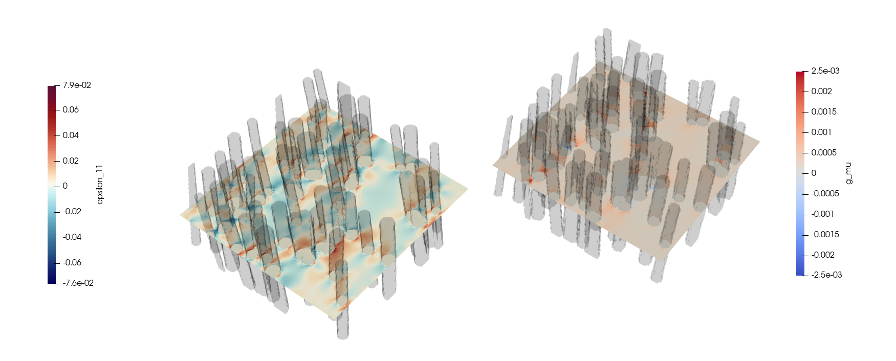
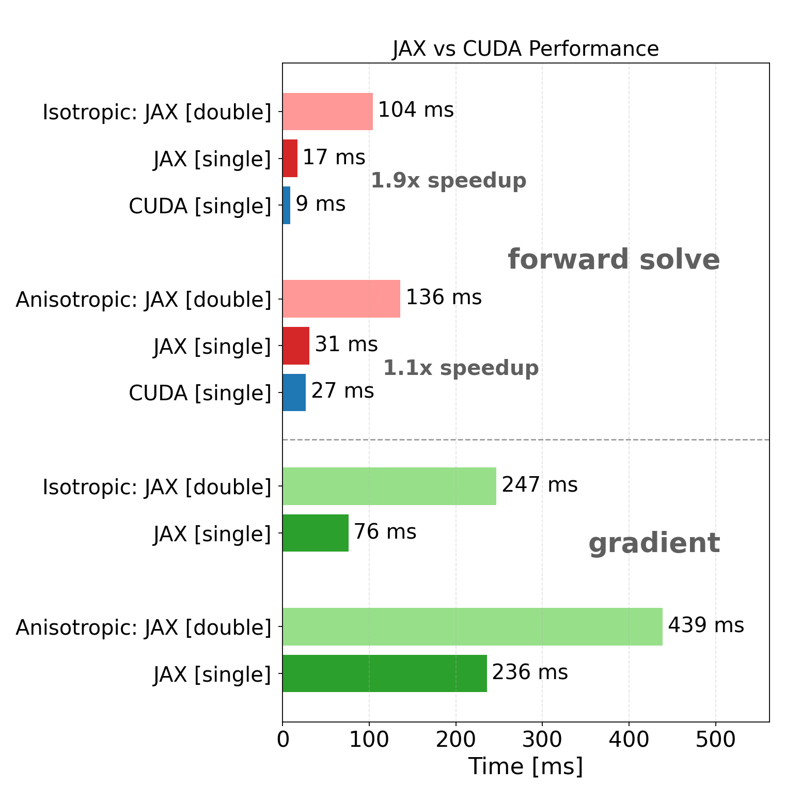

[](https://github.com/eikehmueller/JaxMaterials/actions/workflows/automated-testing.yml)
[](https://github.com/eikehmueller/JaxMaterials/actions/workflows/check-typing.yml)
[](https://github.com/eikehmueller/JaxMaterials/actions/workflows/generate_documentation.yml)

# JaxMaterials

High-performance [JAX](https://docs.jax.dev/en/latest/index.html#)/[CUDA](https://developer.nvidia.com/cuda)-based library for **differentiable materials modelling**, designed to integrate physics-based models into modern machine learning workflows.

Enables gradient-based sensitivity studies and optimisation of ML surrogate models for material simulations, by combining efficient computation with scalable ML infrastructure which can run on CPUs and GPUs.

## Documentation
Further details on the Python API and the mathematical background can be found on the [documentation page](https://eikehmueller.github.io/JaxMaterials/).

## Goals

Materials with fine microstructure, such as carbon fibre composites, are expensive to simulate with classical PDE methods. Upscaling methods require a large number of simulations to infer distributions of material parameters. In addition, it is often desirable to provide

- **Sensitivity** of output to **input parameters**
- Support for **running on CPU and GPU hardware**

Machine learning surrogate models can reduce runtime but require:

- **Fast code** for data generation and inference
- **Differentiable solvers** to use methods like [Physics Enhanced Deep Surrogates](https://arxiv.org/abs/2111.05841)

While JAX provides automatic forward- and reverse-mode differentiation capabilities, iterative solvers with a dynamic stopping criterion require:

- **Custom backward derivative** implementations

Here, this is realised with the adjoint state method.

## Features

- **GPU accelerated differentiable material models** (isotropic & anisotropic) implemented in JAX  
- **Reverse- mode differentiation** with **bespoke adjoint** implementation handles dynamic loop bounds
- **Automatic differentiation** enables sensitivity studies, optimisation and ML training  
- **Bespoke CUDA solvers** for fast data generation and inference
- Modular design for extending models and components
- Compatible with JAX ML pipelines and optimisation frameworks  

## Achievements

### Results

Diagonal stress $\varepsilon_{1,1}(x)$ (left) and sensitivity $dL/d\mu(x)$ of $L=\int_{\Omega} \left(\sigma_{0,0}^2 +\sigma_{1,1}^2 +\sigma_{2,2}^2\right)dx$ with respect to the Lame-parameter $\mu(x)$ (right) for a fibre-resin composite material. The simulation was carried out on a $200\times200\times100$ grid with periodic boundary conditions and a 5% loading $\varepsilon_{0,0}$.



### Performance
The following figure compares the performance of the (an-) isotropic JAX and CUDA solvers when applied to an isotropic material. Results for reverse mode gradient computation with the adjoint state method are also shown.



All results are for a $64\times 64\times 32$ grid. The code was run on a NVIDIA GeForce GTX 1660 Super GPU.

## Quick installation

Clone and run
```
pip install jaxmaterials
```
for the JAX-Python library. See detailed instructions below for CUDA support.

## Sample usage

The following code snippets demonstrate the forward-solve and reverse mode differentiation capabilities.

First, import the necessary libraries and set up the specification of the computational grid

```Python
import numpy as np
import jax

from jax import numpy as jnp

from jaxmaterials.common import GridSpec
from jaxmaterials.solver.lippmann_schwinger import (
    lippmann_schwinger,
    lippmann_schwinger_isotropic,
)

nx = 32
ny = 32
nz = 16

grid_spec = GridSpec(nx, ny, nz, Lx=1.0, Ly=1.0, Lz=0.5)
```

### Forward solve
The interface to the differential solvers for isotropic and anisotropic materials can be found in `lippmann_schwinger.py`.

The forward solve for given random Lame parameters $\mu$, $\lambda$ and mean strain $\overline{\varepsilon}$ requires a call to `lippmann_schwinger_isotropic()` which can optionally use the CUDA backend. It returns the strain $\varepsilon$ and stress $\sigma$:

```Python
rng = np.random.default_rng(seed=47273)

mu = rng.uniform(low=0.8, high=1.1, size=(nx, ny, nz)).astype(np.float32)
lmbda = rng.uniform(low=0.6, high=0.7, size=(nx, ny, nz)).astype(np.float32)
params = {"lambda": lmbda, "mu": mu}
epsilon_bar = rng.normal(size=6).astype(np.float32)

epsilon, sigma = lippmann_schwinger_isotropic(
    params, epsilon_bar, grid_spec, use_cuda=True
)
```

#### Custom stress-strain relationship
Alternatively, the user can define a custom stress-strain relationship, for example

```Python
def compute_sigma(epsilon, params):
    """Custom implementation of linear elasticity for an isotropic material

    :arg epsilon: strain
    :arg params: dictionary with Lame parameters {"lambda": lambda, "mu": mu}
    """
    tr_epsilon = epsilon[0, ...] + epsilon[1, ...] + epsilon[2, ...]
    sigma = 2 * params["mu"] * epsilon + params["lambda"] * jnp.stack(
        3 * [tr_epsilon] + 3 * [jnp.zeros(epsilon.shape[-3:], dtype=epsilon.dtype)]
    )
    return sigma
```

In this case, the reference Lame parameters $\mu^0$ and $\lambda^0$ need to be specified. A common choice is to set $\mu^0=\frac{1}{2}(\max\{\mu\}+\min\{\mu\})$ and $\lambda^0=\frac{1}{2}(\max\{\lambda\}+\min\{\lambda\})$:

```Python
ref_params = {
    key: (np.min(value) + np.max(value)) / 2 for (key, value) in params.items()
}
```

With this, stress and strain can be computed with the generic `lippmann_schwinger()` solver:

```Python
epsilon, sigma = lippmann_schwinger(
    compute_sigma, params, epsilon_bar, ref_params, grid_spec
)
```

### Gradient computation

Since the JAX implementation of `lippmann_schwinger_isotropic()` is fully reverse-mode differentiable, [jax.grad()](https://docs.jax.dev/en/latest/_autosummary/jax.grad.html) can be used to compute the gradient of a loss function $L=L(\varepsilon,\sigma)$ with respect to the inputs $\mu$, $\lambda$ and $\overline{\varepsilon}$. This is demonstrated in the following code snippet:

```Python
def loss_fn(mu, lmbda, epsilon_bar):
    epsilon, sigma = lippmann_schwinger_isotropic(
        mu, lmbda, epsilon_bar, grid_spec=grid_spec
    )
    return jnp.sum(epsilon**2 + sigma**2)


grad_fn = jax.grad(loss_fn, argnums=(0, 1, 2))

g_mu, g_lmbda, g_epsilon_bar = grad_fn(mu, lmbda, epsilon_bar)
```

#### Custom stress-strain relationship
If the user has specified a custom stress-strain relationship, the implementation is very similar, except that in the objective function `lippmann_schwinger()` is called instead of `lippmann_schwinger_isotropic()`

```Python
def loss_fn(params, epsilon_bar):
    epsilon, sigma = lippmann_schwinger(
        compute_sigma, params, epsilon_bar, ref_params, grid_spec
    )
    return jnp.sum(epsilon**2 + sigma**2)


grad_fn = jax.grad(loss_fn, argnums=(0, 1))
g_params, g_epsilon_bar = grad_fn(params, epsilon_bar)
```

## Contents
This repository contains the following code:

### CUDA linear elasticity solver
A highly efficient [CUDA](https://developer.nvidia.com/cuda) accelerated solver of the linear elasticity equation in isotropic materials based on the Lippmann Schwinger method by [[Moulinec and Suquet, 1998. Computer Methods in Applied Mechanics and Engineering, 157(1-2), pp.69-94]](https://arxiv.org/abs/2012.08962).

### Jax linear elasticity solver
A [Jax](https://docs.jax.dev/en/latest/index.html#) implementation of the same method, which allows back-propagation through the solver for later use in a ML setting. Solvers for both isotropic and anisotropic materials have been implemented.

In addition to the plain Lippmann Schwinger solver, the code also supports Anderson acceleration as described in [[Wicht, Schneider and Boehlke, T., 2021. International Journal for Numerical Methods in Engineering, 122(9), pp.2287-2311]](https://onlinelibrary.wiley.com/doi/pdfdirect/10.1002/nme.6622). Since any Jax code is inherently differentiable, the solver can be used as a building block in a machine learning framework (see below).

Both solvers use the same discretisation as the [AMITEX solver](https://amitexfftp.github.io/AMITEX/), which is described in [[Gelebart  2020. Comptes Rendus. Mecanique, 348(8-9), pp.693-704]](https://comptes-rendus.academie-sciences.fr/mecanique/item/CRMECA_2020__348_8-9_693_0/).

## Installation

### Prerequisites 
The CUDA solver requires a working cuda installation, including the [NVidia CUDA Toolkit](https://developer.nvidia.com/cuda/toolkit) which contains the [NVidia CuFFT library](https://developer.nvidia.com/cuda/toolkit). A working C++ compiler and [CMake](https://google.github.io/googletest/) is required to compile and install the solver. To run the automated tests, the [GoogleTest](https://google.github.io/googletest/) is required.

See `pyproject.toml` for a list of required Python packages.

### Instructions
The following instructions should work on Linux machines, but will need to be adapted on Windows and Mac.

#### CUDA solver
1. Clone this repository
2. Change to the `cuda` subdirectory
3. Configure in the `build` directory with
```
cmake -B build -DCMAKE_INSTALL_PREFIX=<INSTALL_DIR>
```
where `<INSTALL_DIR>` is the directory where the solver library should be installed. If the `-DCMAKE_INSTALL_PREFIX=<INSTALL_DIR>` is omitted, the default (usually `/usr/lib/`) is used, and you will likely need root access to install the library in this location.

4. Build the solver with
```
cmake --build build
```
5. (Optionally), if the google test framework is installed, test the library by running
```
./build/bin/test
```
6. Install the library by running
```
cmake --install build
```
7. Add the install directory to `LD_LIBRARY_PATH` to ensure that it can be loaded from Python
```
export LD_LIBRARY_PATH=<INSTALL_DIR>:${LD_LIBRARY_PATH}
```
#### Python library
In the main directory of the repository run
```
python -m pip install .
```
Optionally, add `--editable` flag for an editable install.

Run the tests suite with

```
python -m pytest
```

