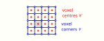

.. |indent| unicode:: 0xA0 0xA0 0xA0 0xA0

Problem description
-------------------

We aim to solve the equations of linear elasticity

.. math::
   :label: eqn:continuum_equations

   \begin{aligned}
           \partial_j \sigma_{ij} &= 0 \\
           \sigma_{ij} &= C_{ijk\ell} \varepsilon_{k\ell}\qquad\text{with $\varepsilon_{k\ell} = \varepsilon^*_{k\ell} + \overline{\varepsilon}_{k\ell}$}\\
           \varepsilon^*_{k\ell} &= \frac{1}{2}\left(\partial_k u_\ell + \partial_\ell u_k\right)
   \end{aligned}

in the domain :math:`\Omega=[0,L_0]\times[0,L_0]\times[0,L_1]`. Let

.. math::
   
   \langle f \rangle_\Omega = \frac{1}{|\Omega|}\int_\Omega f\;dx

denote the spatial average of an arbitrary function :math:`f`. The strain :math:`\varepsilon` is split into is split into a constant symmetric tensor :math:`\overline{\varepsilon}` representing the average strain :math:`\langle \varepsilon_{ij} \rangle =\overline{\varepsilon}_{ij}` and a remainder :math:`\varepsilon^*`. This remainder averages to zero (:math:`\langle \varepsilon^*_{ij}\rangle=0`) since the displacement :math:`u=u(x)` is assumed to be periodic such that :math:`\int_\Omega u_i(x)\;dx = 0` and :math:`\int_\Omega \partial_i u_j(x)\;dx = 0`.

In the stress-strain relationship :math:`\sigma=C\varepsilon` the field :math:`C=C(x)` is the given spatially varying elasticity tensor which has the following form for an isotropic material:

.. math:: C(x) = \lambda(x) \delta_{ij}\delta_{k\ell} + \mu(x) (\delta_{ik}\delta_{j\ell} + \delta_{i\ell}\delta_{jk}).

While in the following discussion we initially focus on an isotropic material for simplicity, below we will also extend the approach to anisotropic materials and a more general stress-strain relationship :math:`\sigma=\sigma(\epsilon)` defined by the user. 

Discretisation
--------------

To discretise the equations of linear elasticity in :eq:`eqn:continuum_equations`, the structured grid in `Fig. 1 <#fig:staggered_grid>`__ in introduced.

   Fig 1: Staggered placement of variables on the grid.

For simplicity, only the two-dimensional version is shown, but in the code we of course use the three-dimensional equivalent.

The different variables are placed at the voxel centres :math:`\mathcal{C}` and voxel
corners (vertices) :math:`\mathcal{V}` as shown in `Tab. 1 <#tab:placement>`__.

.. container:: center

   .. container::
      :name: tab:placement

      .. table:: Tab 1: Placement of variables on grid

         +------------------------+-------------------+-------------------------------------------------------------------------+
         | location               | variable          |                                                                         |
         +========================+===================+=========================================================================+
         | voxel centres          | strain            | :math:`\varepsilon^*_{ij}=\frac{1}{2}(\partial_i u_j + \partial_j u_i)` |
         | :math:`\mathcal{C}`    |                   |                                                                         |
         |                        +-------------------+-------------------------------------------------------------------------+
         |                        | stress            | :math:`\sigma_{ij}=C_{ijk\ell} \varepsilon_{k\ell}`                     |
         +------------------------+-------------------+-------------------------------------------------------------------------+
         | voxel corners          | displacement      | :math:`u_i`                                                             |
         | :math:`\mathcal{V}`    |                   |                                                                         |
         |                        +-------------------+-------------------------------------------------------------------------+
         |                        | stress divergence | :math:`\partial_i \sigma_{ij}`                                          |
         +------------------------+-------------------+-------------------------------------------------------------------------+

Define the first component of the forward gradient
:math:`\boldsymbol{D}^+:\mathcal{V}\rightarrow \mathcal{C}` of a
variable :math:`f\in \mathcal{V}` placed at the voxel corners as

.. math::

   \begin{aligned}
   (D_0^+ f)_{abc} &= \frac{1}{4h_0}\Big[\left(f_{a+1,b,c}+f_{a+1,b+1,c}+f_{a+1,b,c+1}+f_{a+1,b+1,c+1}\right)\\
   & \qquad -\;\;\left(f_{a,b,c}+f_{a,b+1,c}+f_{a,b,c+1}+f_{a,b+1,c+1} \right)\Big]
       \end{aligned}

with corresponding expressions for the other two components :math:`D_1^+ f` and :math:`D_2^+ f`.
The backward gradient
:math:`\boldsymbol{D}^-:\mathcal{C}\rightarrow \mathcal{V}` of a
variable :math:`g\in \mathcal{C}` placed at the voxel centres is given
by

.. math::

   \begin{aligned}
   (D_0^- g)_{abc} &= \frac{1}{4h_0}\Big[\left(g_{a,b,c}+g_{a,b-1,c}+g_{a,b,c-1}+g_{a,b-1,c-1}\right)\\
   & \qquad -\;\;\left(g_{a-1,b,c}+g_{a-1,b-1,c}+g_{a-1,b,c-1}+g_{a-1,b-1,c-1} \right)\Big]
       \end{aligned}

Observe that :math:`-\boldsymbol{D}^+\cdot \boldsymbol{D}^- = -\boldsymbol{D}^-\cdot \boldsymbol{D}^+`
is an approximation of the Laplace operator
:math:`\Delta=\partial_j\partial_j`.

Fourier expansion
^^^^^^^^^^^^^^^^^

The Fourier expansion of a general function :math:`f` is given by

.. math::

   \begin{aligned}
   \widehat{f}_{k_0,k_1,k_2} &= \sum_{n_0=0}^{N_0-1}\sum_{n_1=0}^{N_1-1}\sum_{n_2=0}^{N_2-1} f_{n_0,n_1,n_2}\exp\left[-\frac{2\pi i k_0 n_0}{N_0}-\frac{2\pi i k_1 n_1}{N_1}-\frac{2\pi i k_2 n_2}{N_2}\right] \\
   f_{n_0,n_1,n_2} &= \frac{1}{N_0N_1N_2}\sum_{k_0=0}^{N_0-1}\sum_{k_1=0}^{N_1-1}\sum_{k_2=0}^{N_2-1} \widehat{f}_{k_0,k_1,k_2}\exp\left[\frac{2\pi i k_0 n_0}{N_0}+\frac{2\pi i k_1 n_1}{N_1}+\frac{2\pi  i k_2 n_2}{N_2}\right] 
       \end{aligned}

For given :math:`\boldsymbol{k}\in[0,N_0-1]\times[0,N_1-1]\times[0,N_2-1]` define :math:`\boldsymbol{\xi}\in[0,2\pi]^3` with :math:`\xi_i = \frac{2\pi k_i}{N_i}`, then the Fourier expansion can also be written as

.. math::

   \begin{aligned}
   \widehat{f}_{\boldsymbol{\xi}} &= \sum_{n_0=0}^{N_0-1}\sum_{n_1=0}^{N_1-1}\sum_{n_2=0}^{N_2-1} f_{\boldsymbol{n}}\exp\left[-i\boldsymbol{\xi}\cdot \boldsymbol{n}\right],\\
   f_{\boldsymbol{n}} &= \frac{1}{N_0N_1N_2}\sum_{k_0=0}^{N_0-1}\sum_{k_1=0}^{N_1-1}\sum_{k_2=0}^{N_2-1} \widehat{f}_{\boldsymbol{\xi}}\exp\left[i\boldsymbol{\xi}\cdot\boldsymbol{n}\right] 
   \end{aligned}

It is then easy to see that in Fourier-space we have

.. math:: \widehat{\boldsymbol{D}}^\pm = i \widetilde{\boldsymbol{\xi}} e^{\pm i \eta}

with

.. math::

   \begin{aligned}
   \widetilde{\xi}_0 &= \frac{2}{h_0}\sin\left(\frac{\xi_0}{2}\right)\cos\left(\frac{\xi_1}{2}\right)\cos\left(\frac{\xi_2}{2}\right)\\[1ex]
   \widetilde{\xi}_1 &= \frac{2}{h_1}\cos\left(\frac{\xi_0}{2}\right)\sin\left(\frac{\xi_1}{2}\right)\cos\left(\frac{\xi_2}{2}\right)\\[1ex]
   \widetilde{\xi}_2 &= \frac{2}{h_2}\cos\left(\frac{\xi_0}{2}\right)\cos\left(\frac{\xi_1}{2}\right)\sin\left(\frac{\xi_2}{2}\right)
   \end{aligned}

and

.. math:: \eta = \frac{1}{2}\left(\xi_0+\xi_1+\xi_2\right).

Observe that the phase factor :math:`e^{\pm i\eta}` cancels out in the products :math:`\widehat{D}_i^+ \widehat{D}_j^- = \widehat{D}_i^- \widehat{D}_j^-= -\widetilde{\xi}_i \widetilde{\xi}_j` and in the Fourier-representation of the (negative) Laplacian :math:`-\widehat{\boldsymbol{D}}^+\cdot\widehat{\boldsymbol{D}}^+ = -\widehat{\boldsymbol{D}}^-\cdot\widehat{\boldsymbol{D}}^+ = \widehat{\boldsymbol{\xi}}\cdot \widehat{\boldsymbol{\xi}}`.

Consider the discretised homogeneous equations

.. math::
   :label: eqn:discretised_equations

   \begin{aligned}
   \sigma_{ij} &= C^0_{ijk\ell} D^+_k u_\ell + \tau_{ij},\\
   D^-_j \sigma_{ij} &= 0
   \end{aligned}

for a reference material with constant :math:`C^0`. In Fourier-space
this becomes

.. math::

   \begin{aligned}
   \widehat{\sigma}_{ij} &= ie^{i\eta} C^0_{ijk\ell} \widetilde{\xi}_k \widehat{u}_\ell + \widehat{\tau}_{ij},\\ 
   ie^{-i\eta}\widetilde{\xi}_j \widehat{\sigma}_{ij} &= 0
   \end{aligned}

and therefore

.. math:: K^0_{ik} \widehat{u}_k = ie^{-i\eta} \widehat{\tau}_{ij}\widetilde{\xi}_j

with the acoustic tensor

.. math:: K^0_{ij} = C^0_{ikj\ell} \widetilde{\xi}_k\widetilde{\xi}_{\ell}.

We also have

.. math:: \widehat{\varepsilon}^*_{k\ell} = \frac{i}{2} e^{i\eta} \left(\widetilde{\xi}_k \widehat{u}_\ell+\widetilde{\xi}_\ell \widehat{u}_k\right)

Putting everything together and following the derivation in the appendix of :ref:`moulinec1998numerical` we find that for a homogeneous and isotropic reference material with

.. math:: C^0_{ijk\ell} = \lambda^0 \delta_{ij}\delta_{k\ell} + \mu^0 \left(\delta_{ik}\delta_{j\ell}+\delta_{i\ell}\delta_{jk}\right)

we have

.. math::
   :label: eqn:fourier_expression

   \begin{aligned}
   \widehat{\varepsilon}^*_{k\ell ij} &= -\widehat{\Gamma}^0_{k\ell ij} \widehat{\tau}_{ij}\\
   K^0_{ij} &= (\lambda^0+\mu^0)\widetilde{\xi}_i\widetilde{\xi}_j + \mu^0 |\widetilde{\boldsymbol{\xi}}|^2 \delta_{ij}\\
   N^0_{ij} &=\left((K^0)^{-1}\right)_{ij} = \frac{1}{\mu^0 |\widetilde{\boldsymbol{\xi}}|^2}\left(\delta_{ij}-\frac{\widetilde{\xi}_i\widetilde{\xi}_j}{|\widetilde{\boldsymbol{\xi}}|^2}\frac{\lambda^0+\mu^0}{\lambda^0+2\mu^0}\right)\\
   \widehat{\Gamma}^0_{k\ell ij} &= \frac{1}{4}\left(N^0_{\ell i}\widetilde{\xi}_j\widetilde{\xi}_k+N^0_{k i}\widetilde{\xi}_j\widetilde{\xi}_\ell + N^0_{\ell j}\widetilde{\xi}_i\widetilde{\xi}_k+N^0_{kj}\widetilde{\xi}_i\widetilde{\xi}_\ell\right)\\
   &= \frac{1}{\mu^0}\left(\frac{1}{4}\left(\delta_{\ell i} \mathring{\widetilde{\xi}}_j\mathring{\widetilde{\xi}}_k+\delta_{ki} \mathring{\widetilde{\xi}}_j\mathring{\widetilde{\xi}}_\ell+\delta_{\ell j} \mathring{\widetilde{\xi}}_i\mathring{\widetilde{\xi}}_k+\delta_{k j} \mathring{\widetilde{\xi}}_i\mathring{\widetilde{\xi}}_\ell\right)-\frac{\lambda^0+\mu^0}{\lambda^0+2\mu^0}\mathring{\widetilde{\xi}}_i\mathring{\widetilde{\xi}}_j\mathring{\widetilde{\xi}}_k\mathring{\widetilde{\xi}}_\ell\right)\\
   &= \frac{1}{\mu^0}\left( \widehat{A}_{k\ell ij} - \frac{\lambda^0+\mu^0}{\lambda^0+2\mu^0} \widehat{B}_{k\ell ij}\right)
   \end{aligned}

with

.. math::

   \mathring{\widetilde{\xi}}_i = \begin{cases}
   0 & \text{if $\|\widetilde{\boldsymbol{\xi}}\|=0$}\\
   \widetilde{\xi}_i/\|\widetilde{\boldsymbol{\xi}}\| & \text{otherwise}
   \end{cases}

where :math:`\|\cdot\|` denotes the Euclidean two-norm and we defined

.. math::
   :label: eqn:AB_hat

   \begin{aligned}
   \widehat{A}_{k\ell ij} &= \frac{1}{4}\left(\delta_{\ell i} \mathring{\widetilde{\xi}}_j\mathring{\widetilde{\xi}}_k+\delta_{ki} \mathring{\widetilde{\xi}}_j\mathring{\widetilde{\xi}}_\ell+\delta_{\ell j} \mathring{\widetilde{\xi}}_i\mathring{\widetilde{\xi}}_k+\delta_{k j} \mathring{\widetilde{\xi}}_i\mathring{\widetilde{\xi}}_\ell\right)\\
   \widehat{B}_{k\ell ij} &= \mathring{\widetilde{\xi}}_i\mathring{\widetilde{\xi}}_j\mathring{\widetilde{\xi}}_k\mathring{\widetilde{\xi}}_\ell
   \end{aligned}

If we use Voigt’s notation :ref:`voigt1928lehrbuch` and the
convention used in the `AMITEX code <https://amitexfftp.github.io/AMITEX/index.html>`__ to arrange the six independent
components of the symmetric :math:`3\times 3` tensors
:math:`\widehat{\varepsilon}` and :math:`\widehat{\tau}` into vectors

.. math::

   \begin{aligned}
       \widehat{\boldsymbol{\varepsilon}}^* &=
       \begin{pmatrix}
           \widehat{\varepsilon}^*_{0} &
           \widehat{\varepsilon}^*_{1} &
           \widehat{\varepsilon}^*_{2} &
           \widehat{\varepsilon}^*_{3} &
           \widehat{\varepsilon}^*_{4} &
           \widehat{\varepsilon}^*_{5}
       \end{pmatrix}:= 
       \begin{pmatrix}
           \widehat{\varepsilon}^*_{00} &
           \widehat{\varepsilon}^*_{11} &
           \widehat{\varepsilon}^*_{22} &
           \widehat{\varepsilon}^*_{01} &
           \widehat{\varepsilon}^*_{02} &
           \widehat{\varepsilon}^*_{12}
       \end{pmatrix}\\
       \widehat{\boldsymbol{\tau}} &:= 
       \begin{pmatrix}
           \widehat{\tau}_{0} &
           \widehat{\tau}_{1} &
           \widehat{\tau}_{2} &
           \widehat{\tau}_{3} &
           \widehat{\tau}_{4} &
           \widehat{\tau}_{5}
       \end{pmatrix}= 
       \begin{pmatrix}
           \widehat{\tau}_{00} &
           \widehat{\tau}_{11} &
           \widehat{\tau}_{22} &
           \widehat{\tau}_{01} &
           \widehat{\tau}_{02} &
           \widehat{\tau}_{12}
       \end{pmatrix}
   \end{aligned}

we can write

.. math::
   :label: eqn:epsilon_star

   \widehat{\boldsymbol{\varepsilon}}^* = -\frac{1}{\mu^0}\left(\widehat{\boldsymbol{\varepsilon}}^{*(A)} - \frac{\lambda^0+\mu^0}{\lambda^0+2\mu^0} \widehat{\boldsymbol{\varepsilon}}^{*(B)}\right)

with explicit expressions for :math:`\widehat{\boldsymbol{\varepsilon}}^{*(A)}` and :math:`\widehat{\boldsymbol{\varepsilon}}^{*(B)}` given in :ref:`appendix_epsilon_star`.

Lippmann Schwinger iteration
----------------------------

To solve :eq:`eqn:continuum_equations`, observe that the discretisation of these equations is given by :eq:`eqn:discretised_equations` with

.. math::

   \begin{aligned}
       \tau_{ij} &= (C_{ijk\ell} - C^0_{ijk\ell}) \varepsilon_{k\ell} \\
       &= (\lambda-\lambda^0) \varepsilon_{kk} \delta_{ij} + 2(\mu-\mu^0)\varepsilon_{ij}.
       \end{aligned}

or more explicitly

.. math::
   :label: eqn:tau_computation

   \begin{aligned}
   \tau_{00} &= 2(\mu-\mu^0)\varepsilon_{00} + (\lambda-\lambda^0)\left(\varepsilon_{00}+\varepsilon_{11}+\varepsilon_{22}\right) \\
   \tau_{11} &= 2(\mu-\mu^0)\varepsilon_{11} + (\lambda-\lambda^0)\left(\varepsilon_{00}+\varepsilon_{11}+\varepsilon_{22}\right)\\
   \tau_{22} &= 2(\mu-\mu^0)\varepsilon_{22} + (\lambda-\lambda^0)\left(\varepsilon_{00}+\varepsilon_{11}+\varepsilon_{22}\right)\\
   \tau_{01} &= 2(\mu-\mu^0)\varepsilon_{01}\\
   \tau_{02} &= 2(\mu-\mu^0)\varepsilon_{02}\\
   \tau_{12} &= 2(\mu-\mu^0)\varepsilon_{12}.
   \end{aligned}

This leads to the following self-consistent Lippmann Schwinger equation

.. math::
   :label: eqn:lippmann_schwinger

   \varepsilon = \overline{\varepsilon} - \Gamma^0 * (C-C^0) \varepsilon

which can be solved iteratively according to

.. math::

   \varepsilon^{(s+1)} = \overline{\varepsilon} - \Gamma^0 * (C-C^0) \varepsilon^{(s)}\quad\text{with}\; \varepsilon^{(0)} = \overline{\varepsilon}.

This leads to the iteration shown in :ref:`alg:lippmann_schwinger`. Alternatively the method can be written in incremental form by using the fact that :math:`\Gamma^0*C^0 \varepsilon=\varepsilon`:

.. math::

   \varepsilon^{(s+1)} = \varepsilon^{(s)} - \Gamma^0 * C \varepsilon^{(s)}\quad\text{with}\; \varepsilon^{(0)} = \overline{\varepsilon}

The corresponding method is written down explicitly in :ref:`alg:lippmann_schwinger_incremental`; .

.. _alg:lippmann_schwinger:

.. rubric:: Algorithm 1

*Lippmann Schwinger iteration: simplest formulation*

#. Set :math:`\varepsilon=\overline{\varepsilon}`
#. **For** :math:`n=0,1,\dots`
#. |indent| Compute stress :math:`\sigma_{ij}=C_{ijk\ell}\varepsilon_{k\ell}` according to :eq:`eqn:tau_computation`
#. |indent| Check convergence based on :math:`D^-_j \sigma_{ij}`
#. |indent| Compute stress correction :math:`\tau_{ij}=\sigma_{ij}-C^0_{ijk\ell} \varepsilon_{k\ell}`
#. |indent| Compute :math:`\widehat{\tau}_{ij} = \mathscr{F}[\tau_{ij}]` |indent|  *(Fourier-transform)*
#. |indent| Set :math:`\widehat{\varepsilon}^*_{k\ell} = -\widehat{\Gamma}^0_{k\ell ij} \widehat{\tau}_{ij}` |indent|  *(Solve in Fourier space)*
#. |indent| Update :math:`\varepsilon_{k\ell} = \mathscr{F}^{-1}[\widehat{\varepsilon}^*_{k\ell}]+\overline{\varepsilon}_{k\ell}` |indent|  *(Inverse Fourier-transform)*        
#. **EndFor**
#. **Return** :math:`\varepsilon`

.. _alg:lippmann_schwinger_incremental:

.. rubric:: Algorithm 2

*Lippmann Schwinger iteration: incremental formulation*
    
#. Set :math:`\varepsilon=\overline{\varepsilon}`
#. **For** :math:`n=0,1,\dots`
#. |indent| Compute stress :math:`\sigma_{ij}=C_{ijk\ell}\varepsilon_{k\ell}` according to :eq:`eqn:tau_computation`
#. |indent| Check convergence based on :math:`D^-_j \sigma_{ij}`
#. |indent| Compute :math:`\widehat{\sigma}_{ij} = \mathscr{F}[\sigma_{ij}]` |indent|  *(Fourier-transform)*
#. |indent| Compute :math:`\widehat{r}_{k\ell} = -\widehat{\Gamma}^0_{k\ell ij} \widehat{\sigma}_{ij}` |indent|  *(Solve in Fourier space)*
#. |indent| Compute :math:`r_{ij} = \mathscr{F}^{-1}[\widehat{r}_{ij}]` |indent|  *(Inverse Fourier-transform)*
#. |indent| Update :math:`\varepsilon_{k\ell} \mapsto \varepsilon_{k\ell} + r_{k\ell}`
#. **EndFor**
#. **Return** :math:`\varepsilon`

.. container:: algorithm

   .. container:: algorithmic

Stopping criterion
^^^^^^^^^^^^^^^^^^

The stopping criterion in :ref:`moulinec1998numerical` is
given by

.. math::
   :label: eqn:stopping_criterion
   
   R(\sigma) = \frac{\sqrt{\langle \|\nabla \cdot \sigma\|^2\rangle_\Omega}}{\|\langle\sigma\rangle_\Omega\|} \le \epsilon

In a discrete setting the left hand side of :eq:`eqn:stopping_criterion` can be written as

.. math:: R(\sigma) = \frac{\sqrt{\langle\|D^-\cdot \sigma\|^2\rangle}}{\|\langle \sigma \rangle\|} = \frac{\sqrt{N\langle\|\xi\cdot \widehat{\sigma}\|^2\rangle}}{\|\widehat{\sigma}_{\boldsymbol{\xi}=0}\|} =: \widehat{R}(\widehat{\sigma})

where :math:`\widehat{\sigma}` is the Fourier transform of
:math:`\sigma` and now
:math:`\langle f \rangle = \frac{1}{N}\sum_{\boldsymbol{n}} f_{\boldsymbol{n}}`
with :math:`N:=N_0N_1N_2` the total number of voxels. Define

.. math::

   \begin{aligned}
   \delta &:= D^-\cdot \sigma = 
   \begin{pmatrix}
       D^-_0 \sigma_0 + D^-_1 \sigma_3 + D^-_2 \sigma_4\\
       D^-_0 \sigma_3 + D^-_1 \sigma_1 + D^-_2 \sigma_5\\
       D^-_0 \sigma_4 + D^-_1 \sigma_5 + D^-_2 \sigma_2
   \end{pmatrix}
   \\[2ex]
   \widehat{\delta} &:= \xi \cdot \widehat{\sigma} =
   \begin{pmatrix}
       \xi_0 \widehat{\sigma}_0 + \xi_1 \widehat{\sigma}_3 + \xi_2 \widehat{\sigma}_4\\
       \xi_0 \widehat{\sigma}_3 + \xi_1 \widehat{\sigma}_1 + \xi_2 \widehat{\sigma}_5\\
       \xi_0 \widehat{\sigma}_4 + \xi_1 \widehat{\sigma}_5 + \xi_2 \widehat{\sigma}_2
   \end{pmatrix}
   \end{aligned}

to obtain

.. math:: R(\sigma) = \frac{\|\delta\|}{\sqrt{N}\|\overline{\sigma}\|}

where

.. math::

   \begin{aligned}
   \|\delta\| &= \sqrt{\sum_i\sum_{\boldsymbol{n}}\delta^2_{i\boldsymbol{n}}},\\
    \overline{\sigma_i} &= \frac{1}{N}\sum_{\boldsymbol{n}}\sigma_{i\boldsymbol{n}},\\
    \|\overline{\sigma}\| &= \sqrt{\overline{\sigma}_0^2+\overline{\sigma}_1^2+\overline{\sigma}_2^2 + 2(\overline{\sigma}_3^2+\overline{\sigma}_4^2+\overline{\sigma}_5^2)}
   \end{aligned}
   
Similarly, we find

.. math::

   \widehat{R}(\widehat{\sigma}) = \frac{\|\widehat{\delta}\|}{\|\widehat{\sigma}_{\boldsymbol{\xi}=0}\|}
   \qquad\text{with\quad $\|\widehat{\delta}\| = \sqrt{\sum_i\sum_{\boldsymbol{\xi}}|\widehat{\delta}_{i\boldsymbol{\xi}}|^2}$}.

Anderson acceleration
^^^^^^^^^^^^^^^^^^^^^

The Lippmann-Schwinger algorithm with Anderson acceleration
:ref:`wicht2021anderson` is shown in
`[alg:lippmann_schwinger_anderson] <#alg:lippmann_schwinger_anderson>`__.
It requires additional storage of :math:`2\times(d+1)` tensors for the
state :math:`\varepsilon^{(s)}` and residuals :math:`r^{(s)}`, as well
as a :math:`(d+1)\times (d+1)` matrix and vectors
:math:`u,v\in\mathbb{R}^{d+1}`.

.. _alg:lippmann_schwinger_anderson:

.. rubric:: Algorithm 3

*Lippmann Schwinger iteration: Anderson acceleration with depth* :math:`d`

#. Set :math:`\varepsilon=\overline{\varepsilon}`
#. Initialise :math:`\varepsilon^{(0)} = \varepsilon`, :math:`\varepsilon^{(j)} = 0` for :math:`j=1,2,\dots,d`
#. Initialise :math:`r^{(s)} = 0` for :math:`s=0,1,2,\dots,d`
#. Initialise :math:`(d+1)\times (d+1)` identity matrix :math:`A=\mathbb{I}``
#. **For** :math:`n=0,1,\dots`
#. |indent| Compute stress :math:`\sigma_{ij}=C_{ijk\ell}\varepsilon_{k\ell}` according to :eq:`eqn:tau_computation`
#. |indent| Check convergence based on :math:`D^-_j \sigma_{ij}`
#. |indent| Compute :math:`\widehat{\sigma}_{ij} = \mathscr{F}[\sigma_{ij}]` |indent|  *(Fourier-transform)*
#. |indent| Compute :math:`\widehat{r}_{k\ell} = \widehat{\Gamma}^0_{k\ell ij} \widehat{\sigma}_{ij}` |indent|  *(Solve in Fourier space)*
#. |indent| Set :math:`m_k=\min\{n,d\}`
#. |indent| **For** :math:`s=m_k,m_k-1,\dots,2,1`
#. |indent| |indent| Set :math:`r^{(s)}\gets r^{(s-1)}`
#. |indent| |indent| **For** :math:`t=m_k,m_k-1,\dots,2,1`
#. |indent| |indent| |indent| Set :math:`A_{st}\gets A_{s-1,t-1}`
#. |indent| |indent| **EndFor**
#. |indent| **EndFor**
#. |indent| Compute :math:`r^{(0)}_{ij} = \mathscr{F}^{-1}[\widehat{r}_{ij}]` |indent|  *(Inverse Fourier-transform)*
#. |indent| **For** :math:`s=0,1,2,\dots,m_k`
#. |indent| |indent| Set :math:`A_{0s} = A_{s0}\gets r^{(0)}_{ij}r^{(s)}_{ij}`
#. |indent| **EndFor**
#. |indent| Solve :math:`Av=u` with :math:`u=(1,1,\dots,1)\in\mathbb{R}^{d+1}`
#. |indent| Set :math:`\alpha = v/(u^\top v)`
#. |indent| Set :math:`\varepsilon_{ij} = \sum_{s=0}^{d} \alpha_s (\varepsilon^{(s)}_{ij}-r^{(s)}_{ij})`
#. |indent| **For** :math:`s=m_k,m_k-1,\dots,2,1`
#. |indent| |indent| Set :math:`\varepsilon^{(s)}\gets \varepsilon^{(s-1)}`
#. |indent| **EndFor**
#. |indent| Set :math:`\varepsilon_{ij} \gets \varepsilon_{ij}^{(0)}`
#. **EndFor**
#. **Return** :math:`\varepsilon`

Anisotropic materials
^^^^^^^^^^^^^^^^^^^^^
For an anisotropic material, the stress-strain relationship is

.. math::
   :label: eqn:stress_strain_anisotropic
   
   \sigma_{ij} = C_{ijk\ell}\varepsilon_{k\ell}

where due to the symmetries of :math:`C` only :math:`21` components of the :math:`3\times 3\times 3 \times 3` tensor :math:`C` are independent. Using Voigt-notation these can be taken to be the :math:`21` independent entries :math:`C_{i}` of a symmetric :math:`6\times 6` matrix :math:`C` defined by

.. math::
   :label: eqn:C0_voigt

   \begin{aligned}
   C_{0} &= C_{00,00},  & C_{1} &= C_{11,11},  & C_{2} &= C_{22,22}, \\
   C_{3} &= C_{01,01},  & C_{4} &= C_{02,02},  & C_{5} &= C_{12,12}, \\
   C_{6} &= C_{00,11},  & C_{7} &= C_{00,22},  & C_{8} &= C_{11,22}, \\
   C_{9} &= C_{00,01},  & C_{10} &= C_{00,02},  & C_{11} &= C_{00,12}, \\
   C_{12} &= C_{11,01},  & C_{13} &= C_{11,02},  & C_{14} &= C_{11,12}, \\
   C_{15} &= C_{22,01},  & C_{16} &= C_{22,02},  & C_{17} &= C_{22,12}, \\
   C_{18} &= C_{01,02},  & C_{19} &= C_{01,12},  & C_{20} &= C_{02,12}, \\
   \end{aligned}

Observe that in the isotropic case the only non-zero entries :math:`C_j`
are

.. math::

   \begin{aligned}
   C_0 = C_1 = C_2 &= 2\mu + \lambda,\\
   C_3 = C_4 = C_5 &= \mu,\\
   C_6 = C_7 = C_8 &= \lambda.
   \end{aligned}

In Voigt-notation :eq:`eqn:stress_strain_anisotropic` becomes:

.. math::

   \begin{aligned}
   \sigma_{0} &= {{C}_{0}} {{\varepsilon}_{0}} + {{C}_{6}} {{\varepsilon}_{1}} + {{C}_{7}} {{\varepsilon}_{2}} + 2 {{C}_{9}} {{\varepsilon}_{3}} + 2 {{C}_{10}} {{\varepsilon}_{4}} + 2 {{C}_{11}} {{\varepsilon}_{5}}\\
   \sigma_{1} &= {{C}_{1}} {{\varepsilon}_{1}} + {{C}_{6}} {{\varepsilon}_{0}} + {{C}_{8}} {{\varepsilon}_{2}} + 2 {{C}_{12}} {{\varepsilon}_{3}} + 2 {{C}_{13}} {{\varepsilon}_{4}} + 2 {{C}_{14}} {{\varepsilon}_{5}}\\
   \sigma_{2} &= {{C}_{2}} {{\varepsilon}_{2}} + {{C}_{7}} {{\varepsilon}_{0}} + {{C}_{8}} {{\varepsilon}_{1}} + 2 {{C}_{15}} {{\varepsilon}_{3}} + 2 {{C}_{16}} {{\varepsilon}_{4}} + 2 {{C}_{17}} {{\varepsilon}_{5}}\\
   \sigma_{3} &= 2 {{C}_{3}} {{\varepsilon}_{3}} + {{C}_{9}} {{\varepsilon}_{0}} + {{C}_{12}} {{\varepsilon}_{1}} + {{C}_{15}} {{\varepsilon}_{2}} + 2 {{C}_{18}} {{\varepsilon}_{4}} + 2 {{C}_{19}} {{\varepsilon}_{5}}\\
   \sigma_{4} &= 2 {{C}_{4}} {{\varepsilon}_{4}} + {{C}_{10}} {{\varepsilon}_{0}} + {{C}_{13}} {{\varepsilon}_{1}} + {{C}_{16}} {{\varepsilon}_{2}} + 2 {{C}_{18}} {{\varepsilon}_{3}} + 2 {{C}_{20}} {{\varepsilon}_{5}}\\
   \sigma_{5} &= 2 {{C}_{5}} {{\varepsilon}_{5}} + {{C}_{11}} {{\varepsilon}_{0}} + {{C}_{14}} {{\varepsilon}_{1}} + {{C}_{17}} {{\varepsilon}_{2}} + 2 {{C}_{19}} {{\varepsilon}_{3}} + 2 {{C}_{20}} {{\varepsilon}_{4}}\\
   \end{aligned}

For an anisotropic material the code uses an isotropic reference material characterised by the two constants :math:`\mu^0` and :math:`\lambda^0`. In principle, it would also be possible to use an anisotropic reference material characterised by the 21 independent components of the tensor :math:`C^0`; this is described in :ref:`appendix_Gamma0_anisotropic`.

Reverse mode differentiation with the adjoint method
----------------------------------------------------

Next, we describe how the adjoint method can be used to calculate the sensitivity with respect to input parameters. Assume that we have an objective function

.. math:: J = J(\varepsilon(\cdot),\sigma(\cdot)).

Define the *partial* functional derivatives of :math:`J` with respect to
strain :math:`\varepsilon(x)` and stress
:math:`\sigma(x) = C(x)\varepsilon(x)` as

.. math::
   :label: eqn:J_derivatives

   \begin{aligned}
   E(x) &:= \frac{\delta J}{\delta \varepsilon(x)},\\[2ex]
    S(x) &:= \frac{\delta J}{\delta \sigma(x)},
   \end{aligned}

In a slight abuse of notation, here (and in the following) we implicitly
assume that the quantities defined this way are in fact the
Riesz-representers with respect to the scalar product in
:eq:`eqn:scalar_product`:

.. math::
   :label: eqn:riesz_representer

   \frac{\delta J}{\delta \varepsilon(x)}(H) = E(x):H(x) \qquad\text{for all $H(x)$}.

and similarly for the derivative with respect to :math:`\sigma(x)` where

.. math::
   :label: eqn:scalar_product

   A:B=\sum_{ij}A_{ij}B_{ij}.

This has implications for the implementation which are discussed
:ref:`below <sec:voigt_scalar_product>`. Given :math:`E(x)`, :math:`S(x)` we
want to compute

.. math::
   :label: eqn:func_deriv_anisotropic
   
   \frac{\delta J}{\delta \overline{\varepsilon}},\qquad\frac{\delta J}{\delta C(x)}

in the general, anisotropic case and

.. math::
   :label: eqn:func_deriv_isotropic

   \frac{\delta J}{\delta \overline{\varepsilon}},\qquad\frac{\delta J}{\delta \mu(x)},\qquad\frac{\delta J}{\delta \lambda(x)} 

for isotropic materials. :ref:`Below <sec:generic_stress_model>` we will also consider the general case in which the stress depends on the strain as :math:`\sigma=\sigma(\varepsilon;\theta)` where :math:`\theta` are user-defined parameters and we want to compute :math:`\delta J/\delta \theta(x)`.

Adjoint equation
^^^^^^^^^^^^^^^^

To express the derivatives in :eq:`eqn:func_deriv_anisotropic`, :eq:`eqn:func_deriv_isotropic` in terms of the given :math:`E(x)`, :math:`S(x)` with the adjoint method, first note that the strain field satisfies the Lippmann-Schwinger equation :eq:`eqn:lippmann_schwinger`

.. math::
   :label: eqn:lippmann_schwinger
   
   \varepsilon(x) = \overline{\varepsilon} - \int_\Omega \Gamma^0(x-y) \tau(y)\;dy

with :math:`\tau(x) = \left(C(x)-C^0\right)\varepsilon(x)`. Define the residual operator

.. math::
   :label: eqn:residual_operator
   
   \mathcal{A}(\varepsilon;C,\overline{\varepsilon}) := \varepsilon + \Gamma^0 * \left((C-C^0) \varepsilon\right) - \overline{\varepsilon}

and introduce the Lagrangian

.. math::
   :label: eqn:lagrangian
   
   \mathcal{L}(\varepsilon,\Lambda;C,\overline{\varepsilon}) = \mathcal{J}(\varepsilon) + \int_\Omega \Lambda(z) : \mathcal{A}(\varepsilon;C,\overline{\varepsilon})\;dz\qquad\text{with $\mathcal{J}(\varepsilon) = J(\varepsilon,\sigma(\varepsilon))$}

The Lagrange multiplier :math:`\Lambda(x)` has been introduced to make
:math:`\mathcal{L}` independent of :math:`\varepsilon(x)`, i.e. we
require that the total derivative with respect to :math:`\varepsilon(x)`
vanishes:

.. math:: \frac{\delta\mathcal{L}}{\delta\varepsilon(x)} = 0.

To compute the derivative of the integral on the right hand side of
:eq:`eqn:lagrangian`, observe that

.. math::

   \begin{aligned}
           \frac{\delta}{\delta\varepsilon(x)}\int_\Omega \Lambda(z) : \mathcal{A}(\varepsilon;C,\overline{\varepsilon})(z)\;dz&=\frac{\delta}{\delta\varepsilon(x)}\Big( \int_\Omega \Lambda(z):\varepsilon(z)\;dz\\
           &\quad+\;\;\int_{\Omega}\int_{\Omega}\Lambda(z) : \Gamma^0(z-y)\left(C(y)-C^0\right)\varepsilon(y)\;dy\;dz\Big)\\
   &=\Lambda(x) + \int_\Omega \Lambda(z):\Gamma^0(z-x)\left(C(x)-C^0\right)\;dz \\
   &=\Lambda(x) +  \left(C(x)-C^0\right) \int_\Omega  \Gamma^0(x-z) \Lambda(z)\;dz
       \end{aligned}

where the last identity follows from :math:`\Gamma^0(-x) = \Gamma^0(x)`, :math:`\Gamma^0_{ijk\ell} = \Gamma^0_{k\ell ij}` and :math:`C_{ijk\ell}=C_{k\ell ij}`. This leads to

.. math:: 0 = \frac{\delta\mathcal{L}}{\delta\varepsilon} = \frac{\delta \mathcal{J}}{\delta \varepsilon} + \Lambda + \left(C-C^0\right) \left(\Gamma^0 * \Lambda\right)

The derivatives in :eq:`eqn:J_derivatives` are *partial* derivatives. Using the definition of the stress :math:`\sigma(x) = C(x)\varepsilon(x)`, the *total* derivative which appears on the right hand side of the adjoint equation is

.. math::

   \begin{aligned}
   \frac{\delta \mathcal{J}}{\delta \varepsilon(x)} &= \frac{\delta J}{\delta \varepsilon(x)}+ C(x)\frac{\delta J}{\delta \sigma(x)}\\
   &=E(x)+ C(x)S(x).
       \end{aligned}

Hence, the adjoint equation is

.. math::
   :label: eqn:adjoint_equation
   
   \Lambda + \left(C-C^0\right) : \left(\Gamma^0 * \Lambda\right) = \mathcal{E}\qquad\text{with $\mathcal{E}(x):= -\left(E(x)+ C(x)S(x)\right)$}

The Lippmann-Schwinger iteration for solving the adjoint equation in :eq:`eqn:adjoint_equation` is shown in :ref:`alg:lippmann_schwinger_adjoint`.

.. _alg:lippmann_schwinger_adjoint:

.. rubric:: Algorithm 4

*Adjoint Lippmann Schwinger iteration (simplest form)*

#. Set :math:`\Lambda=0`
#. **For** :math:`n=0,1,\dots`
#. |indent| Compute :math:`\widehat{\Lambda}_{ij} = \mathscr{F}[\Lambda_{ij}]`  *(Fourier-transform)*
#. |indent| Set :math:`\widehat{\Theta}_{k\ell} = -\widehat{\Gamma}^0_{k\ell ij} \widehat{\Lambda}_{ij}` |indent| *(Solve in Fourier space)*
#. |indent| Compute :math:`\Theta_{k\ell} = \mathscr{F}^{-1}[\widehat{\Theta}_{k\ell}]` |indent| *(Inverse Fourier-transform)*
#. |indent| Update :math:`\Lambda_{ij}=\mathcal{E}_{ij}+(C-C^0)_{ijk\ell}\Theta_{k\ell}`
#. |indent| Check convergence
#. **EndFor**
#. **Return** :math:`\Lambda`

Comparing :ref:`alg:lippmann_schwinger` and :ref:`alg:lippmann_schwinger_adjoint`, we see that the primal- and adjoint Lippmann Schwinger iteration only differ in the order in which :math:`\Gamma^0` and :math:`C` are applied and in the update step. Also, the algorithm is readily applied to both the isotropic and anisotropic case by use the appropriate way of computing :math:`(C-C^0)\Theta`.

Derivatives with respect to material parameters
^^^^^^^^^^^^^^^^^^^^^^^^^^^^^^^^^^^^^^^^^^^^^^^

The derivative with respect to :math:`C` is made up of two
contributions. First, the direct contribution is

.. math:: \frac{\delta \mathcal{J}}{\delta C_{ijk\ell}(x)} = S_{ij}(x)\varepsilon_{k\ell}(x).

Second, the adjoint contribution is obtained by observing that

.. math::

   \begin{aligned}
       \frac{\delta }{\delta C_{ijk\ell}(x)} \int_\Omega \Lambda(z) : \mathcal{A}(\varepsilon;C,\overline{\varepsilon})\;dz &=\frac{\delta }{\delta C_{ijk\ell}(x)} \int_\Omega\int_\Omega \Lambda_{ab}(z)\Gamma^0_{abcd}(z-y)\left(C(y)-C^0\right)_{cdrs}\varepsilon_{rs}(y)\;dy\;dz\\
       &= \int_\Omega \Lambda_{ab}(z)\Gamma^0_{abij}(z-x)\varepsilon_{k\ell}(x)\;dz\\
       &= \left(\int_\Omega\Gamma^0_{ijab}(x-z)\Lambda_{ab}(z)\;dz\right)\varepsilon_{k\ell}(x)\\
       &= \left(\Gamma^0*\Lambda\right)_{ij}(x)\varepsilon_{k\ell}(x)
       \end{aligned}

Putting everything together, we get

.. math::
   :label: eqn:gradC

   \frac{\delta \mathcal{L}}{\delta C_{ijk\ell}} = S^*_{ij}\varepsilon_{k\ell}
   \qquad\text{where $S^* = S+\Gamma^0*\Lambda$.}
   

The derivative with respect to :math:`\overline{\varepsilon}` only has
an adjoint contribution:

.. math::

   \begin{aligned}
       \frac{\delta}{\delta \overline{\varepsilon}} \int_\Omega \Lambda(z) : \mathcal{A}(\varepsilon;C,\overline{\varepsilon})\;dz &= -\int_\Omega \Lambda(z) \;dz
       \end{aligned}

Anisotropic case: derivatives with respect to :math:`C(x)`
~~~~~~~~~~~~~~~~~~~~~~~~~~~~~~~~~~~~~~~~~~~~~~~~~~~~~~~~~~

The tensor :math:`C` is symmetric, i.e.
:math:`C_{ijk\ell} = C_{k\ell ij}`. This can be taken into account by
setting

.. math::

   \frac{\delta \mathcal{L}}{\delta C_{ijk\ell}} =\begin{cases} S^*_{ij}\varepsilon_{ij} & \text{if $i=k$ and $j=\ell$}, \\
       S^*_{ij}\varepsilon_{k\ell} + \varepsilon_{ij}S^*_{k\ell}& \text{otherwise},
   \end{cases}

where :math:`S^*` is defined in :eq:`eqn:gradC`.

Isotropic case: derivatives with respect to :math:`\lambda(x)` and :math:`\mu(x)`
~~~~~~~~~~~~~~~~~~~~~~~~~~~~~~~~~~~~~~~~~~~~~~~~~~~~~~~~~~~~~~~~~~~~~~~~~~~~~~~~~

In the isotropic case where
:math:`C_{ijk\ell} = \lambda \delta_{ij}\delta_{k\ell} + \mu (\delta_{ik}\delta_{j\ell} + \delta_{i\ell}\delta_{jk})`
we get with the chain rule

.. math::

   \begin{aligned}
   \frac{\delta \mathcal{L}}{\delta \lambda} &= \frac{\delta \mathcal{L}}{\delta C_{ijkl}}\frac{\delta C_{ijkl}}{\delta \lambda} = \frac{\delta \mathcal{L}}{\delta C_{ijkl}} \delta_{ij}\delta_{k\ell},\\[1ex]
   \frac{\delta \mathcal{L}}{\delta \mu} &= \frac{\delta \mathcal{L}}{\delta C_{ijkl}}\frac{\delta C_{ijkl}}{\delta \mu} = \frac{\delta \mathcal{L}}{\delta C_{ijkl}} (\delta_{ik}\delta_{j\ell}+\delta_{i\ell}\delta_{jk})
   \end{aligned}

and therefore

.. math::

   \begin{aligned}
   \frac{\delta \mathcal{L}}{\delta \lambda} &= \operatorname{tr}\left(S^*\right)\operatorname{tr}(\varepsilon),\\
   \frac{\delta \mathcal{L}}{\delta \mu} &= 2\; S^*:\varepsilon.\\
   \end{aligned}

with :math:`S^*` given in :eq:`eqn:gradC`.

Generic stress-strain model
^^^^^^^^^^^^^^^^^^^^^^^^^^^

While so far we assumed that :math:`\sigma=C\varepsilon`, we now
consider a more generic model of the form
:math:`\sigma=\Sigma(\varepsilon|\theta)` where the map :math:`\Sigma`
depends linearly on :math:`\varepsilon` and :math:`\theta` stands for
all input parameters. We assume that the differentiable function
:math:`\Sigma` has been implemented by the user. Instead of
:math:`\delta J/\delta C(x)` as in
:eq:`eqn:func_deriv_anisotropic` or
:math:`\delta J/\delta \lambda(x)`, :math:`\delta J/\delta \mu(x)` in
:eq:`eqn:func_deriv_isotropic` we are
interested in computing the derivative

.. math:: \frac{\delta J}{\delta \theta(x)}.

subject to :math:`\varepsilon(x)` satisfying the Lippmann-Schwinger
equation in :eq:`eqn:lippmann_schwinger` with

.. math::
   :label: eqn:tau_generic
   
   \tau = \Sigma(\varepsilon|\theta) - \lambda^0 \operatorname{tr}(\varepsilon)\mathbb{I}-2\mu^0\varepsilon

for given :math:`\overline{\varepsilon}`. Here we have picked an
isotropic, homogeneous reference material characterised by the two Lame
parameters :math:`\lambda^0`, :math:`\mu^0`. The residual operator in
:eq:`eqn:residual_operator` is replaced by

.. math::
   :label: eqn:residual_operator
   
   \mathcal{A}(\varepsilon;\theta,\overline{\varepsilon}) := \varepsilon + \Gamma^0 * \left(\Sigma(\varepsilon|\theta) - \lambda^0 \operatorname{tr}(\varepsilon)-2\mu^0\varepsilon\right) - \overline{\varepsilon}

and the Lagrangian in :eq:`eqn:lagrangian` is modified appropriately. The resulting adjoint equation is

.. math::

   \Lambda + (\Gamma^0*\Lambda)\frac{\delta \Sigma}{\delta \varepsilon} - \lambda^0 \operatorname{tr}(\Gamma^0*\Lambda)\mathbb{I} - 2\mu^0 (\Gamma^0*\Lambda) = \mathcal{E} 
   \qquad\text{with $\mathcal{E}(x) = -\left(E(x) + S(x)\frac{\delta \Sigma}{\delta \varepsilon}(x)\right)$}

This results in the Lippmann-Schwinger iteration in :ref:`alg:lippmann_schwinger_adjoint_generic`.

.. _alg:lippmann_schwinger_adjoint_generic:

.. rubric:: Algorithm 5

*Adjoint Lippmann Schwinger iteration (generic stress-strain relationship)*

#. Set :math:`\Lambda=0`
#. **For** :math:`n=0,1,\dots`
#. |indent| Compute :math:`\widehat{\Lambda}_{ij} = \mathscr{F}[\Lambda_{ij}]` |indent| *(Fourier-transform)*
#. |indent| Set :math:`\widehat{\Theta}_{k\ell} = -\widehat{\Gamma}^0_{k\ell ij} \widehat{\Lambda}_{ij}` |indent| *(Solve in Fourier space)*
#. |indent| Compute :math:`\Theta_{k\ell} = \mathscr{F}^{-1}[\widehat{\Theta}_{k\ell}]` |indent| *(Inverse Fourier-transform)*
#. |indent| Update :math:`\Lambda_{ij}=\mathcal{E}_{ij} + \Theta_{k\ell}\frac{\delta \Sigma_{k\ell}}{\delta \varepsilon_{ij}} -\lambda^0 \Theta_{kk} \delta_{ij} - 2 \mu^0 \Theta_{ij}`
#. |indent| Check convergence
#. **EndFor**
#. **Return** :math:`\Lambda`

The strain :math:`\varepsilon` can still be computed with :ref:`alg:lippmann_schwinger_incremental`, provided :math:`\sigma` is obtained from :math:`\varepsilon` according to :math:`\sigma=\Sigma(\varepsilon|\theta)`. Observe that the terms :math:`S\frac{\delta \Sigma}{\delta \varepsilon}` and :math:`S\frac{\delta\Sigma}{\delta\varepsilon}` are vector-Jacobian products, so they are naturally implemented as `jax.vjp <https://docs.jax.dev/en/latest/_autosummary/jax.vjp.html>`__'s. The derivative with respect to the parameters :math:`\theta` is

.. math:: \left(S+\Gamma^0*\Lambda\right):\frac{\delta \Sigma}{\delta \theta}

which is again a `jax.vjp <https://docs.jax.dev/en/latest/_autosummary/jax.vjp.html>`__.

An Anderson-accelerated version of :ref:`alg:lippmann_schwinger_adjoint_generic` is shown in :ref:`alg:lippmann_schwinger_adjoint_generic_anderson`.

.. _alg:lippmann_schwinger_adjoint_generic_anderson:

.. rubric:: Algorithm 6

*Adjoint Lippmann Schwinger iteration (generic stress-strain relationship, Anderson acceleration with depth* :math:`d`

#. Set :math:`\Lambda=\mathcal{E}_{ij}`
#. Initialise :math:`\Lambda^{(0)}=\Lambda`, :math:`\Lambda^{(s)}=0` for :math:`j=1,2,\dots,d`
#. Initialise :math:`r^{(s)}=0` for :math:`s=0,1,2,\dots,d`
#. Initialise :math:`(d+1)\times(d+1)` identity matrix :math:`A=\mathbb{I}`
#. **For** :math:`n=0,1,\dots`
#. |indent| Set :math:`m_k=\min\{n,d\}`
#. |indent| **For** :math:`s=m_k,m_k-1,\dots,2,1`
#. |indent| |indent| Set :math:`r^{(s)}\gets r^{(s-1)}`
#. |indent| |indent| **For** :math:`t=m_k,m_k-1,\dots,2,1`
#. |indent| |indent| |indent| Set :math:`A_{st}\gets A_{s-1,t-1}`
#. |indent| |indent| **EndFor**
#. |indent| **EndFor**
#. |indent| Compute :math:`\widehat{\Lambda}_{ij} = \mathscr{F}[\Lambda_{ij}]$` |indent| *(Fourier-transform)*
#. |indent| Set :math:`\widehat{\Theta}_{k\ell} = -\widehat{\Gamma}^0_{k\ell ij} \widehat{\Lambda}_{ij}` |indent| *(Solve in Fourier space)*
#. |indent| Compute :math:`\Theta_{k\ell} = \mathscr{F}^{-1}[\widehat{\Theta}_{k\ell}]`  |indent| *(Inverse Fourier-transform)*
#. |indent| Set :math:`r^{(0)}_{ij}=\Lambda_{ij}-\mathcal{E}_{ij} - \Theta_{k\ell}\frac{\delta \Sigma_{k\ell}}{\delta \varepsilon_{ij}} +\lambda^0 \Theta_{kk} \delta_{ij} + 2 \mu^0 \Theta_{ij}`
#. |indent| Check convergence by inspecting :math:`\|r^{(0)}\|`
#. |indent| **For** :math:`s=0,1,2,\dots,m_k`
#. |indent| |indent| Set :math:`A_{0s}=A_{s0}\gets r^{(0)}_{ij} r^{(s)}_{ij}`
#. |indent| **EndFor**
#. |indent| Solve :math:`Av=u` with :math:`u=(1,1,\dots,1)\in\mathbb{R}^{d+1}`
#. |indent| Set :math:`\alpha=v/(u^\top v)`
#. |indent| Set :math:`\Lambda_{ij} = \sum_{s=0}^d\alpha_s(\Lambda^{(s)}_{ij}-r^{(s)}_{ij})`
#. |indent| **For** :math:`s=m_k,m_k-1,\dots,2,1`
#. |indent| |indent| Set :math:`\Lambda^{(s)}\gets \Lambda^{(s-1)}`
#. |indent| **EndFor**
#. |indent| Set :math:`\Lambda_{ij}\gets \Lambda^{(0)}`
#. **EndFor**
#. **Return** :math:`\Lambda`

References
^^^^^^^^^^

.. _moulinec1998numerical:

[Moulinec, Suquet (1998)]
~~~~~~~~~~~~~~~~~~~~~~~~~

Moulinec, Herve and Suquet, Pierre (1998): *A numerical method for computing the overall response of nonlinear composites with complex microstructure*. Computer methods in applied mechanics and engineering, volume 157, number 1-2, pages 69-94

.. _voigt1928lehrbuch:

[Voigt (1928)]
~~~~~~~~~~~~~~~

Voigt, Woldemar (1928): *Lehrbuch der Kristallphysik (Textbook of crystal physics)*, BG Teubner, Leipzig und Berlin

.. _wicht2021anderson:

[Wicht et al. (2021)]
~~~~~~~~~~~~~~~~~~~~~

Wicht, Daniel and Schneider, Matti and Böhlke, Thomas (2021): *Anderson-accelerated polarization schemes for fast Fourier transform-based computational homogenization*, International Journal for Numerical Methods in Engineering, volume 122, number 9, pages 2287--2311, Wiley Online Library

.. _appendix_epsilon_star:

Appendix A
----------

In the following we give explicit expressions for :math:`\widehat{\boldsymbol{\varepsilon}}^{*(A)}` and :math:`\widehat{\boldsymbol{\varepsilon}}^{*(B)}` that appear in :eq:`eqn:epsilon_star`

.. math::

   \begin{aligned}    
       \widehat{\boldsymbol{\varepsilon}}^{*(A)} &= \begin{pmatrix}
       \mathring{\widetilde{\xi}}_0^2 \widehat{\tau}_0 + \mathring{\widetilde{\xi}}_0(\mathring{\widetilde{\xi}}_2\widehat{\tau}_4+\mathring{\widetilde{\xi}}_1\widehat{\tau}_3)\\[2ex]
       \mathring{\widetilde{\xi}}_1^2 \widehat{\tau}_1 + \mathring{\widetilde{\xi}}_1(\mathring{\widetilde{\xi}}_2\widehat{\tau}_5+\mathring{\widetilde{\xi}}_0\widehat{\tau}_3)\\[2ex]
       \mathring{\widetilde{\xi}}_2^2 \widehat{\tau}_2 + \mathring{\widetilde{\xi}}_2(\mathring{\widetilde{\xi}}_1\widehat{\tau}_5+\mathring{\widetilde{\xi}}_0\widehat{\tau}_4)\\[2ex]
       \frac{1}{2}\left(\mathring{\widetilde{\xi}}_0\mathring{\widetilde{\xi}}_1(\widehat{\tau}_0+\widehat{\tau}_1)+(\mathring{\widetilde{\xi}}_0^2+\mathring{\widetilde{\xi}}_1^2)\widehat{\tau}_3+\mathring{\widetilde{\xi}}_2(\mathring{\widetilde{\xi}}_0\widehat{\tau}_5+\mathring{\widetilde{\xi}}_1\widehat{\tau}_4)\right)\\[2ex]
       \frac{1}{2}\left(\mathring{\widetilde{\xi}}_0\mathring{\widetilde{\xi}}_2(\widehat{\tau}_0+\widehat{\tau}_2)+(\mathring{\widetilde{\xi}}_0^2+\mathring{\widetilde{\xi}}_2^2)\widehat{\tau}_4+\mathring{\widetilde{\xi}}_1(\mathring{\widetilde{\xi}}_0\widehat{\tau}_5+\mathring{\widetilde{\xi}}_2\widehat{\tau}_3)\right)\\[2ex]
       \frac{1}{2}\left(\mathring{\widetilde{\xi}}_1\mathring{\widetilde{\xi}}_2(\widehat{\tau}_1+\widehat{\tau}_2)+(\mathring{\widetilde{\xi}}_1^2+\mathring{\widetilde{\xi}}_2^2)\widehat{\tau}_5+\mathring{\widetilde{\xi}}_0(\mathring{\widetilde{\xi}}_1\widehat{\tau}_4+\mathring{\widetilde{\xi}}_2\widehat{\tau}_3)\right)
       \end{pmatrix}
   \end{aligned}

and

.. math::

   \begin{aligned}    
       \widehat{\boldsymbol{\varepsilon}}^{*(B)} &= 
       \left(
       \mathring{\widetilde{\xi}}_0^2\widehat{\tau}_0+ \mathring{\widetilde{\xi}}_1^2\widehat{\tau}_1+ \mathring{\widetilde{\xi}}_2^2\widehat{\tau}_2+ 2(\mathring{\widetilde{\xi}}_0\mathring{\widetilde{\xi}}_1\widehat{\tau}_3+ \mathring{\widetilde{\xi}}_0 \mathring{\widetilde{\xi}}_2\widehat{\tau}_4+\mathring{\widetilde{\xi}}_1\mathring{\widetilde{\xi}}_2\widehat{\tau}_5)
       \right)\begin{pmatrix}
       \mathring{\widetilde{\xi}}_0^2 \\[2ex] \mathring{\widetilde{\xi}}_1^2 \\[2ex] \mathring{\widetilde{\xi}}_2^2 \\[2ex] \mathring{\widetilde{\xi}}_0\mathring{\widetilde{\xi}}_1 \\[2ex] \mathring{\widetilde{\xi}}_0 \mathring{\widetilde{\xi}}_2 \\[2ex] \mathring{\widetilde{\xi}}_1\mathring{\widetilde{\xi}}_2
       \end{pmatrix}^\top 
   \end{aligned}

where the expression for
:math:`\widehat{\boldsymbol{\varepsilon}}^{*(A)}=\widehat{A}\widehat{\boldsymbol{\tau}}`
follows from the :math:`6\times 6` matrix representation of
:math:`\widehat{A}_{k\ell ij}` defined in :eq:`eqn:AB_hat` when using Voigt’s notation

.. math::

   \widehat{A} = \begin{pmatrix}
       \mathring{\widetilde{\xi}}_0^2 & 0 & 0 & \mathring{\widetilde{\xi}}_0\mathring{\widetilde{\xi}}_1 & \mathring{\widetilde{\xi}}_0\mathring{\widetilde{\xi}}_2 & 0 \\[2ex]
       0 & \mathring{\widetilde{\xi}}_1^2 & 0 & \mathring{\widetilde{\xi}}_0\mathring{\widetilde{\xi}}_1 & 0 & \mathring{\widetilde{\xi}}_1\mathring{\widetilde{\xi}}_2\\[2ex]
       0 & 0 & \mathring{\widetilde{\xi}}_2^2 & 0 & \mathring{\widetilde{\xi}}_0\mathring{\widetilde{\xi}}_2 & \mathring{\widetilde{\xi}}_1\mathring{\widetilde{\xi}}_2\\[2ex]
       \frac{1}{2}\mathring{\widetilde{\xi}}_0\mathring{\widetilde{\xi}}_1 & \frac{1}{2}\mathring{\widetilde{\xi}}_0\mathring{\widetilde{\xi}}_1 & 0 & \frac{1}{2}(\mathring{\widetilde{\xi}}_0^2+\mathring{\widetilde{\xi}}_1^2) & \frac{1}{2}\mathring{\widetilde{\xi}}_1\mathring{\widetilde{\xi}}_2 & \frac{1}{2}\mathring{\widetilde{\xi}}_0\mathring{\widetilde{\xi}}_2\\[2ex]
       \frac{1}{2}\mathring{\widetilde{\xi}}_0\mathring{\widetilde{\xi}}_2 & 0 & \frac{1}{2}\mathring{\widetilde{\xi}}_0\mathring{\widetilde{\xi}}_2 & \frac{1}{2}\mathring{\widetilde{\xi}}_1\mathring{\widetilde{\xi}}_2 & \frac{1}{2}(\mathring{\widetilde{\xi}}_0^2+\mathring{\widetilde{\xi}}_2^2) & \frac{1}{2}\mathring{\widetilde{\xi}}_0\mathring{\widetilde{\xi}}_1\\[2ex]
       0 & \frac{1}{2}\mathring{\widetilde{\xi}}_1\mathring{\widetilde{\xi}}_2 & \frac{1}{2}\mathring{\widetilde{\xi}}_1\mathring{\widetilde{\xi}}_2 & \frac{1}{2}\mathring{\widetilde{\xi}}_0\mathring{\widetilde{\xi}}_2 & \frac{1}{2}\mathring{\widetilde{\xi}}_0\mathring{\widetilde{\xi}}_1 & \frac{1}{2}(\mathring{\widetilde{\xi}}_1^2+\mathring{\widetilde{\xi}}_2^2)
       \end{pmatrix}

.. _appendix_Gamma0_anisotropic:

Appendix B
^^^^^^^^^^

While we do not use this in the code, in principle one could construct the tensor :math:`\widehat{\Gamma}^{0}_{k\ell ij}` for an anisotropic reference material characterised by the 21 independent components of :math:`C^0` as defined in :eq:`eqn:C0_voigt`. For each Fourier mode we can compute the symmetric :math:`3\times 3` matrix :math:`K^{0}` with

.. math::

   \begin{aligned}
   K^0_{00} &= {C^{0}_{0}} {{\mathring{{\widetilde{{\xi}}}}}_{0}}^{2} + {C^{0}_{3}} {{\mathring{{\widetilde{{\xi}}}}}_{1}}^{2} + {C^{0}_{4}} {{\mathring{{\widetilde{{\xi}}}}}_{2}}^{2} + 2 {C^{0}_{9}} {{\mathring{{\widetilde{{\xi}}}}}_{0}} {{\mathring{{\widetilde{{\xi}}}}}_{1}} + 2 {C^{0}_{10}} {{\mathring{{\widetilde{{\xi}}}}}_{0}} {{\mathring{{\widetilde{{\xi}}}}}_{2}} + 2 {C^{0}_{18}} {{\mathring{{\widetilde{{\xi}}}}}_{1}} {{\mathring{{\widetilde{{\xi}}}}}_{2}}\\
   K^0_{10} &= {C^{0}_{3}} {{\mathring{{\widetilde{{\xi}}}}}_{0}} {{\mathring{{\widetilde{{\xi}}}}}_{1}} + {C^{0}_{6}} {{\mathring{{\widetilde{{\xi}}}}}_{0}} {{\mathring{{\widetilde{{\xi}}}}}_{1}} + {C^{0}_{9}} {{\mathring{{\widetilde{{\xi}}}}}_{0}}^{2} + {C^{0}_{11}} {{\mathring{{\widetilde{{\xi}}}}}_{0}} {{\mathring{{\widetilde{{\xi}}}}}_{2}} + {C^{0}_{12}} {{\mathring{{\widetilde{{\xi}}}}}_{1}}^{2} + {C^{0}_{13}} {{\mathring{{\widetilde{{\xi}}}}}_{1}} {{\mathring{{\widetilde{{\xi}}}}}_{2}} + {C^{0}_{18}} {{\mathring{{\widetilde{{\xi}}}}}_{0}} {{\mathring{{\widetilde{{\xi}}}}}_{2}} + {C^{0}_{19}} {{\mathring{{\widetilde{{\xi}}}}}_{1}} {{\mathring{{\widetilde{{\xi}}}}}_{2}} + {C^{0}_{20}} {{\mathring{{\widetilde{{\xi}}}}}_{2}}^{2}\\
   K^0_{11} &= {C^{0}_{1}} {{\mathring{{\widetilde{{\xi}}}}}_{1}}^{2} + {C^{0}_{3}} {{\mathring{{\widetilde{{\xi}}}}}_{0}}^{2} + {C^{0}_{5}} {{\mathring{{\widetilde{{\xi}}}}}_{2}}^{2} + 2 {C^{0}_{12}} {{\mathring{{\widetilde{{\xi}}}}}_{0}} {{\mathring{{\widetilde{{\xi}}}}}_{1}} + 2 {C^{0}_{14}} {{\mathring{{\widetilde{{\xi}}}}}_{1}} {{\mathring{{\widetilde{{\xi}}}}}_{2}} + 2 {C^{0}_{19}} {{\mathring{{\widetilde{{\xi}}}}}_{0}} {{\mathring{{\widetilde{{\xi}}}}}_{2}}\\
   K^0_{20} &= {C^{0}_{4}} {{\mathring{{\widetilde{{\xi}}}}}_{0}} {{\mathring{{\widetilde{{\xi}}}}}_{2}} + {C^{0}_{7}} {{\mathring{{\widetilde{{\xi}}}}}_{0}} {{\mathring{{\widetilde{{\xi}}}}}_{2}} + {C^{0}_{10}} {{\mathring{{\widetilde{{\xi}}}}}_{0}}^{2} + {C^{0}_{11}} {{\mathring{{\widetilde{{\xi}}}}}_{0}} {{\mathring{{\widetilde{{\xi}}}}}_{1}} + {C^{0}_{15}} {{\mathring{{\widetilde{{\xi}}}}}_{1}} {{\mathring{{\widetilde{{\xi}}}}}_{2}} + {C^{0}_{16}} {{\mathring{{\widetilde{{\xi}}}}}_{2}}^{2} + {C^{0}_{18}} {{\mathring{{\widetilde{{\xi}}}}}_{0}} {{\mathring{{\widetilde{{\xi}}}}}_{1}} + {C^{0}_{19}} {{\mathring{{\widetilde{{\xi}}}}}_{1}}^{2} + {C^{0}_{20}} {{\mathring{{\widetilde{{\xi}}}}}_{1}} {{\mathring{{\widetilde{{\xi}}}}}_{2}}\\
   K^0_{21} &= {C^{0}_{5}} {{\mathring{{\widetilde{{\xi}}}}}_{1}} {{\mathring{{\widetilde{{\xi}}}}}_{2}} + {C^{0}_{8}} {{\mathring{{\widetilde{{\xi}}}}}_{1}} {{\mathring{{\widetilde{{\xi}}}}}_{2}} + {C^{0}_{13}} {{\mathring{{\widetilde{{\xi}}}}}_{0}} {{\mathring{{\widetilde{{\xi}}}}}_{1}} + {C^{0}_{14}} {{\mathring{{\widetilde{{\xi}}}}}_{1}}^{2} + {C^{0}_{15}} {{\mathring{{\widetilde{{\xi}}}}}_{0}} {{\mathring{{\widetilde{{\xi}}}}}_{2}} + {C^{0}_{17}} {{\mathring{{\widetilde{{\xi}}}}}_{2}}^{2} + {C^{0}_{18}} {{\mathring{{\widetilde{{\xi}}}}}_{0}}^{2} + {C^{0}_{19}} {{\mathring{{\widetilde{{\xi}}}}}_{0}} {{\mathring{{\widetilde{{\xi}}}}}_{1}} + {C^{0}_{20}} {{\mathring{{\widetilde{{\xi}}}}}_{0}} {{\mathring{{\widetilde{{\xi}}}}}_{2}}\\
   K^0_{22} &= {C^{0}_{2}} {{\mathring{{\widetilde{{\xi}}}}}_{2}}^{2} + {C^{0}_{4}} {{\mathring{{\widetilde{{\xi}}}}}_{0}}^{2} + {C^{0}_{5}} {{\mathring{{\widetilde{{\xi}}}}}_{1}}^{2} + 2 {C^{0}_{16}} {{\mathring{{\widetilde{{\xi}}}}}_{0}} {{\mathring{{\widetilde{{\xi}}}}}_{2}} + 2 {C^{0}_{17}} {{\mathring{{\widetilde{{\xi}}}}}_{1}} {{\mathring{{\widetilde{{\xi}}}}}_{2}} + 2 {C^{0}_{20}} {{\mathring{{\widetilde{{\xi}}}}}_{0}} {{\mathring{{\widetilde{{\xi}}}}}_{1}}\\
   \end{aligned}

As a sanity check, we can compute :math:`K^0` for the isotropic case,
i.e. :math:`C^0_0=C^0_1=C^0_2=2\mu^0+\lambda^0`,
:math:`C^0_3=C^0_4=C^5_0=\mu^0`, :math:`C^0_6=C^0_7=C^0_8=\lambda^0`. In
this case we find

.. math::

   \begin{aligned}
   K^0_{00} &= \mu^{0} {{\mathring{{\widetilde{{\xi}}}}}_{1}}^{2} + \mu^{0} {{\mathring{{\widetilde{{\xi}}}}}_{2}}^{2} + \left(\lambda^{0} + 2 \mu^{0}\right) {{\mathring{{\widetilde{{\xi}}}}}_{0}}^{2}\\
   K^0_{10} &= \left(\lambda^{0} + \mu^{0}\right) {{\mathring{{\widetilde{{\xi}}}}}_{0}} {{\mathring{{\widetilde{{\xi}}}}}_{1}}\\
   K^0_{11} &= \mu^{0} {{\mathring{{\widetilde{{\xi}}}}}_{0}}^{2} + \mu^{0} {{\mathring{{\widetilde{{\xi}}}}}_{2}}^{2} + \left(\lambda^{0} + 2 \mu^{0}\right) {{\mathring{{\widetilde{{\xi}}}}}_{1}}^{2}\\
   K^0_{20} &= \left(\lambda^{0} + \mu^{0}\right) {{\mathring{{\widetilde{{\xi}}}}}_{0}} {{\mathring{{\widetilde{{\xi}}}}}_{2}}\\
   K^0_{21} &= \left(\lambda^{0} + \mu^{0}\right) {{\mathring{{\widetilde{{\xi}}}}}_{1}} {{\mathring{{\widetilde{{\xi}}}}}_{2}}\\
   K^0_{22} &= \mu^{0} {{\mathring{{\widetilde{{\xi}}}}}_{0}}^{2} + \mu^{0} {{\mathring{{\widetilde{{\xi}}}}}_{1}}^{2} + \left(\lambda^{0} + 2 \mu^{0}\right) {{\mathring{{\widetilde{{\xi}}}}}_{2}}^{2}\\
   \end{aligned}

which is equivalent to
:math:`K^0_{ij} = (\lambda^0+\mu^0)\mathring{\widetilde{\xi}}_i\mathring{\widetilde{\xi}}_j + \mu^0 |\mathring{\widetilde{\boldsymbol{\xi}}}|^2 \delta_{ij}`.

The inverse of :math:`K^0` is the :math:`3\times 3` matrix
:math:`N^{0}`. This requires storage of additional 6 numbers for each
Fourier mode. From this, build the symmetric :math:`6\times 6` matrix
which is defined by

.. math::

   \begin{aligned}
   \widehat{\Gamma}^{0}_{00} &= N^{0}_{00} \mathring{{\widetilde{{\xi}}}}_{0}^{2}, & 
   \widehat{\Gamma}^{0}_{01} &= N^{0}_{01} \mathring{{\widetilde{{\xi}}}}_{0} \mathring{{\widetilde{{\xi}}}}_{1},\\[1ex]
   \widehat{\Gamma}^{0}_{02} &= N^{0}_{02} \mathring{{\widetilde{{\xi}}}}_{0} \mathring{{\widetilde{{\xi}}}}_{2}, & 
   \widehat{\Gamma}^{0}_{03} &= \frac{\mathring{{\widetilde{{\xi}}}}_{0} \left(N^{0}_{00} \mathring{{\widetilde{{\xi}}}}_{1} + N^{0}_{01} \mathring{{\widetilde{{\xi}}}}_{0}\right)}{2},\\[1ex]
   \widehat{\Gamma}^{0}_{04} &= \frac{\mathring{{\widetilde{{\xi}}}}_{0} \left(N^{0}_{00} \mathring{{\widetilde{{\xi}}}}_{2} + N^{0}_{02} \mathring{{\widetilde{{\xi}}}}_{0}\right)}{2}, & 
   \widehat{\Gamma}^{0}_{05} &= \frac{\mathring{{\widetilde{{\xi}}}}_{0} \left(N^{0}_{01} \mathring{{\widetilde{{\xi}}}}_{2} + N^{0}_{02} \mathring{{\widetilde{{\xi}}}}_{1}\right)}{2},\\[1ex]
   \widehat{\Gamma}^{0}_{11} &= N^{0}_{11} \mathring{{\widetilde{{\xi}}}}_{1}^{2}, & 
   \widehat{\Gamma}^{0}_{12} &= N^{0}_{12} \mathring{{\widetilde{{\xi}}}}_{1} \mathring{{\widetilde{{\xi}}}}_{2},\\[1ex]
   \widehat{\Gamma}^{0}_{13} &= \frac{\mathring{{\widetilde{{\xi}}}}_{1} \left(N^{0}_{01} \mathring{{\widetilde{{\xi}}}}_{1} + N^{0}_{11} \mathring{{\widetilde{{\xi}}}}_{0}\right)}{2}, & 
   \widehat{\Gamma}^{0}_{14} &= \frac{\mathring{{\widetilde{{\xi}}}}_{1} \left(N^{0}_{01} \mathring{{\widetilde{{\xi}}}}_{2} + N^{0}_{12} \mathring{{\widetilde{{\xi}}}}_{0}\right)}{2},\\[1ex]
   \widehat{\Gamma}^{0}_{15} &= \frac{\mathring{{\widetilde{{\xi}}}}_{1} \left(N^{0}_{11} \mathring{{\widetilde{{\xi}}}}_{2} + N^{0}_{12} \mathring{{\widetilde{{\xi}}}}_{1}\right)}{2}, & 
   \widehat{\Gamma}^{0}_{22} &= N^{0}_{22} \mathring{{\widetilde{{\xi}}}}_{2}^{2},\\[1ex]
   \widehat{\Gamma}^{0}_{23} &= \frac{\mathring{{\widetilde{{\xi}}}}_{2} \left(N^{0}_{02} \mathring{{\widetilde{{\xi}}}}_{1} + N^{0}_{12} \mathring{{\widetilde{{\xi}}}}_{0}\right)}{2}, & 
   \widehat{\Gamma}^{0}_{24} &= \frac{\mathring{{\widetilde{{\xi}}}}_{2} \left(N^{0}_{02} \mathring{{\widetilde{{\xi}}}}_{2} + N^{0}_{22} \mathring{{\widetilde{{\xi}}}}_{0}\right)}{2},\\[1ex]
   \widehat{\Gamma}^{0}_{25} &= \frac{\mathring{{\widetilde{{\xi}}}}_{2} \left(N^{0}_{12} \mathring{{\widetilde{{\xi}}}}_{2} + N^{0}_{22} \mathring{{\widetilde{{\xi}}}}_{1}\right)}{2}, & 
   \widehat{\Gamma}^{0}_{33} &= \frac{N^{0}_{00} \mathring{{\widetilde{{\xi}}}}_{1}^{2}}{4} + \frac{N^{0}_{01} \mathring{{\widetilde{{\xi}}}}_{0} \mathring{{\widetilde{{\xi}}}}_{1}}{2} + \frac{N^{0}_{11} \mathring{{\widetilde{{\xi}}}}_{0}^{2}}{4},\\[1ex]
   \widehat{\Gamma}^{0}_{34} &= \frac{N^{0}_{00} \mathring{{\widetilde{{\xi}}}}_{1} \mathring{{\widetilde{{\xi}}}}_{2}}{4} + \frac{N^{0}_{01} \mathring{{\widetilde{{\xi}}}}_{0} \mathring{{\widetilde{{\xi}}}}_{2}}{4} + \frac{N^{0}_{02} \mathring{{\widetilde{{\xi}}}}_{0} \mathring{{\widetilde{{\xi}}}}_{1}}{4} + \frac{N^{0}_{12} \mathring{{\widetilde{{\xi}}}}_{0}^{2}}{4}, & 
   \widehat{\Gamma}^{0}_{35} &= \frac{N^{0}_{01} \mathring{{\widetilde{{\xi}}}}_{1} \mathring{{\widetilde{{\xi}}}}_{2}}{4} + \frac{N^{0}_{02} \mathring{{\widetilde{{\xi}}}}_{1}^{2}}{4} + \frac{N^{0}_{11} \mathring{{\widetilde{{\xi}}}}_{0} \mathring{{\widetilde{{\xi}}}}_{2}}{4} + \frac{N^{0}_{12} \mathring{{\widetilde{{\xi}}}}_{0} \mathring{{\widetilde{{\xi}}}}_{1}}{4},\\[1ex]
   \widehat{\Gamma}^{0}_{44} &= \frac{N^{0}_{00} \mathring{{\widetilde{{\xi}}}}_{2}^{2}}{4} + \frac{N^{0}_{02} \mathring{{\widetilde{{\xi}}}}_{0} \mathring{{\widetilde{{\xi}}}}_{2}}{2} + \frac{N^{0}_{22} \mathring{{\widetilde{{\xi}}}}_{0}^{2}}{4}, & 
   \widehat{\Gamma}^{0}_{45} &= \frac{N^{0}_{01} \mathring{{\widetilde{{\xi}}}}_{2}^{2}}{4} + \frac{N^{0}_{02} \mathring{{\widetilde{{\xi}}}}_{1} \mathring{{\widetilde{{\xi}}}}_{2}}{4} + \frac{N^{0}_{12} \mathring{{\widetilde{{\xi}}}}_{0} \mathring{{\widetilde{{\xi}}}}_{2}}{4} + \frac{N^{0}_{22} \mathring{{\widetilde{{\xi}}}}_{0} \mathring{{\widetilde{{\xi}}}}_{1}}{4},\\[1ex]
   \widehat{\Gamma}^{0}_{55} &= \frac{N^{0}_{11} \mathring{{\widetilde{{\xi}}}}_{2}^{2}}{4} + \frac{N^{0}_{12} \mathring{{\widetilde{{\xi}}}}_{1} \mathring{{\widetilde{{\xi}}}}_{2}}{2} + \frac{N^{0}_{22} \mathring{{\widetilde{{\xi}}}}_{1}^{2}}{4}, & 
   \end{aligned}

With this, we can compute

.. math:: \widehat{\sigma}_i = -\widehat{\Gamma}^{0}_{ij} \widehat{\tau}_j.

.. _sec:voigt_scalar_product:

Appendix C
^^^^^^^^^^

Care has to be taken when using Voigt notation. Representing a symmetric
:math:`3\times 3` matrix :math:`A` by the six numbers

.. math::
   
    a_0 = A_{00},\quad
    a_1 = A_{11},\quad
    a_2 = A_{22},\quad
    a_3 = A_{01},\quad
    a_4 = A_{02},\quad
    a_5 = A_{12}

we have for the dot-product of two matrices :math:`A` and :math:`B`

.. math:: A:B = a_0 b_0 + a_1 b_1 + a_2 b_2 + 2 (a_3 b_3 + a_4 b_4 + a_5 b_5) = \sum_{j=0}^{5} w_j a_j b_j =: \langle a,b\rangle_{V}.

with

.. math::
   :label: eqn:voigt_weight
   
   w^{\text{(Voigt)}} = \begin{pmatrix}1 & 1 & 1 & 2 & 2 &2\end{pmatrix}.

This differs from the normal, Euclidean dot-product

.. math:: a\cdot b = \langle a,b\rangle = \sum_{j=0}^{5} a_j b_j.

In `JAX <https://docs.jax.dev/en/latest/index.html>`__ the numerical values of tensors that represent derivatives (which
mathematically are dual vectors) are the Riesz-representers with respect
to the :math:`\langle \cdot,\cdot \rangle`. For example, the derivative
with respect to :math:`A` would be defined by

.. math:: \frac{\delta J}{\delta A}(H) = \langle g^E, h \rangle \qquad\text{for all $h$}

This differs from :eq:`eqn:riesz_representer`, where

.. math:: \frac{\delta J}{\delta A}(H) = G : H = \langle g , h\rangle_V \qquad\text{for all $h$}.

This implies that :math:`g_j = g^E_j / w^{\text{(Voigt)}}_j` with the
weights :math:`w^{\text{(Voigt)}}` given in
:eq:`eqn:voigt_weight`. To take care of this in the
code we need to:

- Divide all incoming tensor-valued gradients elementwise by
  :math:`w^{\text{(Voigt)}}`

- Multiply all outgoing tensor-valued gradients elementwise with
  :math:`w^{\text{(Voigt)}}`.

.. _sec:generic_stress_model: