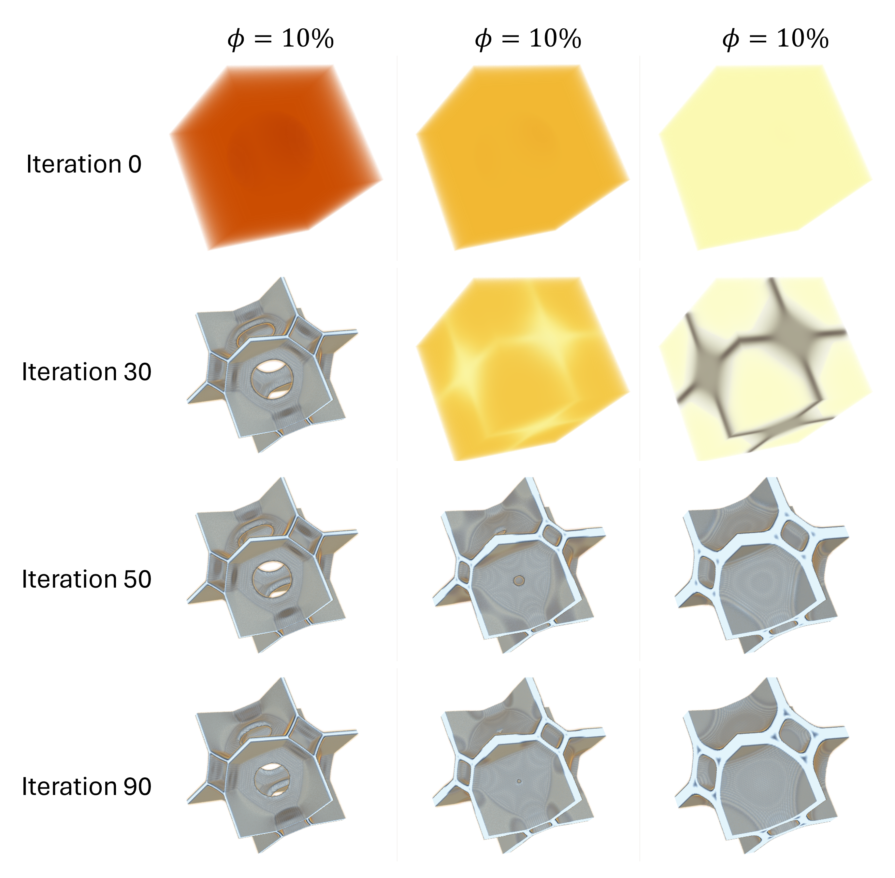
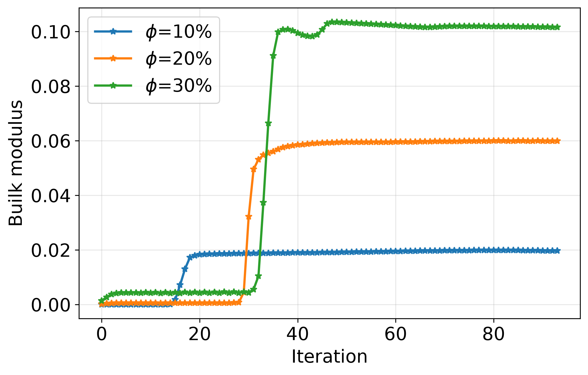
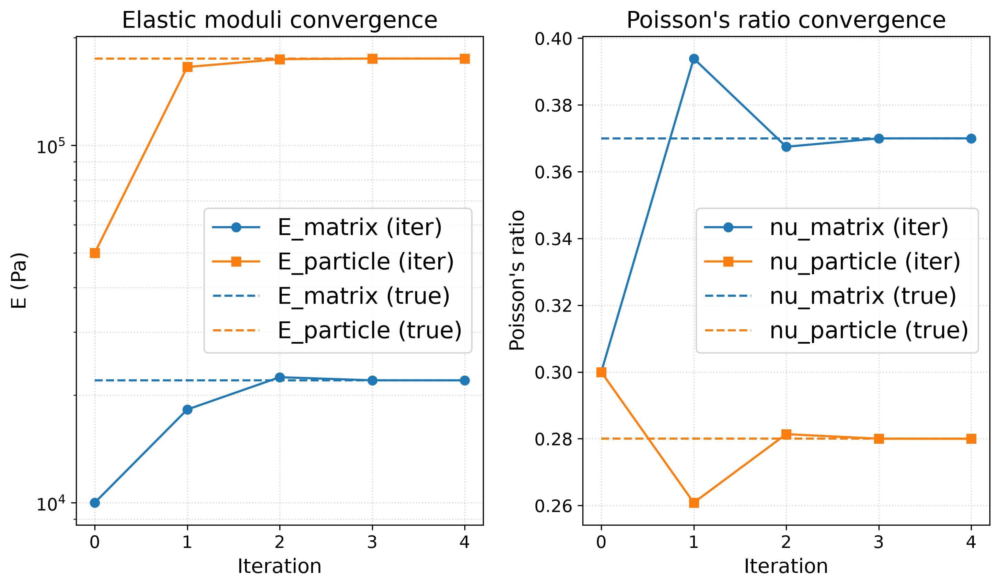

# Summary
Many applications in Scientific Computing require not only the fast solution of a forward problem $\theta\rightarrow u \rightarrow J$, which relates some input parameters $\theta$ to the solution $u=u(\theta)$ of a partial differential equations (PDE) and ultimately an objective function $J=J(u(\theta))$, but also the computation of sensitivites $\delta J/\delta \theta$. Recently, powerful frameworks such as JAX @Bradbury:2018 have become available to address this challenge while allowing the user to express the problem at a high abstraction level. We introduce an differentiable JAX-based package for solving an important system of coupled PDEs that arises in continuum mechanics. This allows the efficient modelling of problems which are described by the stationary Cauchy equation together with a user-defined constituitive law that relates stress $\sigma$ and strain $\varepsilon$. The user interacts with the library by defining a custom function `compute_sigma(epsilon,param)` which describes this constituitive law that can depend on arbitrary parameters $\theta$ encoded in `params`. The code is inherently differentiable and uses the adjoint state method @Hinze:2008 to propagate gradients through the iterative Lippmann Schwinger solver introduced in @Moulinec:1998; Anderson acceleration @Wicht:2021 to improve computational efficiency is also supported. We demonstrate the application of our code to several practical problems that are relevant to the engineering communitiy.

# Statement of need

## Differentiable material modelling
Many materials encountered in engineering have a heterogeneous microstructure. Practically relevant examples include particle-/fibre- reinforced composites, polycrystalline metals, porous solids, and architecture metamaterials. Understanding how microscopic material arrangements determine macroscopic mechanical properties remains a central challenge in materials science and engineering. Numerical simulations have become indispensable for establishing these microstructure-property relationsihps and for guiding the design of advanced materials.

The mechanical response of heterogeneous materials is commonly described by the equilibrium equation

$$
\nabla \cdot \sigma = 0
$$

where the local stress field $\sigma(x)$ is linked to the local strain $\varepsilon(x)$ through a constitutive law

$$
\sigma = \Sigma(\varepsilon|\theta)
$$
with material parameters $\theta$. For example, in linear elasticity, $\theta$ corresponds to the spatially varying elasticity tensor $C(x)$ and the constitutive relation reduces to $\sigma_{ij}(x)=\sum_{\ell}C_{ijk\ell}(x)\varepsilon_{k\ell}(x)$. 

Accurate simulation of heterogeneous materials is computationally demanding due to the large separation of spatial scales. The resolution of fine microstructural features requires discretisation on fine computational grids, while strong material contrast, anisotropy and nonlinear constitutive behaviour can make the numerical solution challenging.

Forward simulation alone is increasingly insufficient. Material parameters are notoriously difficult to measure directly and must be inferred from experimental data. In addition, physics-based simulations are now frequently combined with machine-learning models in applications such as inverse modelling (@wang2025differentiable), uncertainty quantification (@akhare2024probabilistic), and scientific machine learning (@Pestourie:2023). These workflows require efficient computation of sensitivities with respect to model parameters, making differentiable PDE solvers an essential component (@shen2023differentiable).

## State of the field
Since the seminal work of @Moulinec:1998, FFT-based Lippmann-Schwinger solvers have become a standard approach for computing stress and strain fields in heterogeneous materials. The approach is particularly attractive for simulations on regular grids and on modern parallel hardware (@chen2019analysis). 
Lippmann-Schwinger solvers form the basis of mature software packages such as AMITEX (@Gelebart:2020), which provides highly optimised CPU implementations for large-scale material simulations. More recently, GPU-accelerated computing has emerged as an important direction for accelerating large-scale simulation of materials with fine microstructures **REFERENCE**.

Advances in differentiable programming have sparked growing interest in differentiable materials simulations. Frameworks such as JAX (@Bradbury:2018) and PyTorch (@Paszke:2019) provide automatic differentiation capabilities together with execution on CPUs and GPUs, enabling the integration of PDE solvers into optimisation and machine-learning workflows. In the work of @Pundir:2025, a JAX-based framework is proposed. Users can specify constitutive relations and derivatives are generated automatically by JAX. Efficiency is achieved through just-in-time (JIT) compilation. In a related study, the authors of @Pundir:2026 use automatic differentiation to derive governing equations from energy functionals and solve them using the finite element method. Similarly, @Bluhdorn:2022 presents a C++ framework that combines automatic differentiation with GPU acceleration.

Despite these advances, existing differentiable implementations face important limitations. Directly applying JAX's automatic differentiation to iterative solvers is often computationally unfeasible: Forward-mode differentiation based on Jacobian-vector products (called JVPs in JAX) becomes expensive when the number of input parameters greatly exceeds the number of objective quantities, as is common in real applications. Reverse-mode differentiation is usually more efficient, but backpropagating through iterative solvers presents two challenges. First, all intermediate states must be stored during the forward pass, resulting in substantial memory costs. Second, practical solvers rely on dynamic stopping criteria, whereas efficient reverse-mode differentiation in JAX requires knowledge of the number of iterations at (just-in-time) compile time.  The adjoint-state method addresses these challenges, and it has become widely adopted in finite element frameworks, for example through the pyadjoint library (@Mitusch:2019), which is integrated with Firedrake (@Farrell:2013; @Rathgeber:2016). The resulting toolchain has recently been applied to materials modelling (@Farsi:2025). However, most differentiable PDE frameworks are built on finite element discretisations which, although highly flexible, are generally less computationally efficient than FFT-based methods for microstructure simulations on structured grids. Existing differentiable FFT implementations, such as @Pundir:2025, leverage automatic differentiation but are not primarily designed for memory-efficient reverse-mode differentiation of iterative solvers for large-scale problems.

## Main achievements
Our work combines the computational efficiency of FFT-based Lippmann-Schwinger solvers (@Moulinec:1998; @Schneider:2021) with the flexibility of differentiable programming in JAX. Users can define arbitrary constitutive laws $\sigma=\Sigma(\varepsilon|\theta)$ through a simple Python interface while benefiting from JIT compilation and GPU acceleration. The adjoint-state method allows memory-efficient reverse-mode differentiation and support for dynamical stopping criteria in the iterative solver. To our knowledge, this is the first open-source framework that combines a modular constitutive-law interface, efficient adjoint-based differentiation, and FFT-based computational homogenisation within a unified JAX ecosystem. The resulting software can be used for inverse parameter identification, uncertainty quantification, and machine-learning-assisted materials modelling.

# Mathematical background
To motivate the design of the software we briefly review the relevant mathematical details.

## PDE Problem
We consider the following system of equations for spatially varying strain $\varepsilon$ and stress $\sigma$:

$$
\begin{aligned}
    \sum_j \partial_j \sigma_{ij} &= 0 & \text{(Cauchy momentum equation)}\\
    \sigma_{ij} &= \Sigma_{ij}(\varepsilon|\theta)\qquad\text{with $\varepsilon_{k\ell} = \varepsilon^*_{k\ell} + \overline{\varepsilon}_{k\ell}$} & \text{(Constituitive law)}\\
    \varepsilon^*_{k\ell} &= \frac{1}{2}\left(\partial_k u_\ell + \partial_\ell u_k\right) & \text{(Strain-displacement relation)}
\end{aligned}
\label{eqn:pde_problem}
$$

The problem is solved in a cuboid domain with periodic boundary conditions for the displacement field $u(x)$ and for given average strain $\overline{\varepsilon}$.

The problem-dependent constituitive law $\sigma = \Sigma(\varepsilon|\theta)$ depends on the parameters $\theta$. Special cases are:

* General linear materials with $\sigma_{ij} = \sum_{k\ell}C_{ijk\ell} \varepsilon_{k\ell}$ where $C=C(x)=:\theta$ is the spatially varying elasticity tensor
* Isotropic linear materials for which $C_{ijk\ell}(x) = \lambda(x) \delta_{ij}\delta_{k\ell} + \mu(x) (\delta_{ik}\delta_{j\ell} + \delta_{i\ell}\delta_{jk})$. In this case $\theta$ encapsulates the two Lame parameters $\{\mu(x),\lambda(x)\}=:\theta$.

## Lippmann Schwinger iteration

The problem in (\autoref{eqn:continuum}) can be written in the form 

$$
\varepsilon + \Gamma^0 * (\Sigma(\varepsilon|\theta) - C^0 \varepsilon)= \overline{\varepsilon}
$$

In this equation $*$ denotes convolution and $C^0$ is the homogenous isotropic elasticity tensor described by the two reference Lame parameters $\mu^0,\lambda^0\in\mathbb{R}$. The operator $\Gamma^0$ is constructed from the tensor-valued Green's function of the corresponding PDE (see appendix of @Moulinec:1998). 

As discussed in @Moulinec:1998, the self-consistent equation in (\autoref{eqn:lippmann_schwinger}) is solved by exploiting the fact that $\Gamma^0$ is diagonal in Fourier space and by applying the Lippmann Schwinger iteration

$$
\varepsilon^{(s+1)} = \overline{\varepsilon} - \mathcal{F}^{-1} \circ\widehat{\Gamma}^0 \circ\mathcal{F}\tau^{(s)} \qquad\text{with $\tau^{(s)} = (\Sigma(\varepsilon^{(s)}|\theta) - C^0\varepsilon^{(s)})$ and $\varepsilon^{(0)} = \overline{\varepsilon}$}
$$

Here $\mathcal{F}$ and $\mathcal{F}^{-1}$ denote the forward and inverse Fourier transform respectively. 

To improve robustness we adopted the rotated discretisation scheme of (@willot2015fourier) which is also used in AMITEX (@Gelebart:2020). As in (@chen2019analysis), Anderson acceleration (@Wicht:2021) is used to reduce the number of iterations. For linear stress-strain relations, this is equivalent to a preconditioned GMRES iteration (@Walker:2011).

## Reverse-mode differentiation with the adjoint method

Let $J=J(\varepsilon,\sigma)$ be the objective function representing, for example, the average stress, total strain energy, or effective bulk modulus. We want to compute the sensitivities of $J$

$$
\frac{\delta J}{\delta \theta},\quad \frac{\delta J}{\delta \overline{\varepsilon}}
$$

subject to the condition that strain $\varepsilon=\varepsilon(\theta,\overline{\varepsilon})$ and stress $\sigma=\sigma(\theta,\overline{\varepsilon})$ satisfy the equations in (\autoref{eqn:continuum}) for given $\overline{\varepsilon}$ and material parameters $\theta$.

Since every step of the Lippmann Schwinger iteration consists of elementary, differential operations, in principle the sensitivites can be obtained with JAX automatic differentiation capabilities provided the constitutitive law $\sigma=\Sigma(\varepsilon|\theta)$ is differentiable. However, reverse mode-differentiation is not available for while-loops since the number of iterations is unknown at (just-in-time) compile time. To address this, we employ the adjoint state method @Hinze:2008, @Johnson:2012. This leads to an adjoint Lippmann Schwinger equation of a very simular structure as (\autoref{eqn:lippmann_schwinger}):

$$
\Lambda + (\Gamma^0*\Lambda)\frac{\delta \Sigma}{\delta \varepsilon} - \lambda^0 \operatorname{tr}(\Gamma^0*\Lambda)\mathbb{I} - 2\mu^0 (\Gamma^0*\Lambda) = -\left(\frac{\delta J}{\delta \varepsilon}+\frac{\delta J}{\delta \sigma}\frac{\delta \Sigma}{\delta \varepsilon}\right)
$$

The adjoint equation is solved iteratively with Anderson acceleration. From the adjoint state $\Lambda$ the derivatives of the objective function $J$ with respect to the parameters $\theta$ and the average strain $\overline{\varepsilon}$ can be computed as

$$
\frac{\delta J}{\delta\theta} = \left(\frac{\delta J}{\delta\sigma} + \Gamma^0*\Lambda\right): \frac{\delta\Sigma}{\delta \theta},\qquad
\frac{\delta J}{\delta\overline{\varepsilon}} = -\int_\Omega \Lambda(z)\;dz.
$$

# Software design

## JAX implementation

Since the code is based on JAX, all functions are pure and parameters are passed as state variables. The central functionality is exposed through the function `lippmann_schwinger()` whichs gets passed as a user-defined constituitive law $\Sigma(\varepsilon|\theta)$ of the form:

```Python
def compute_sigma(epsilon, params):
    # Compute stress sigma from strain epsilon, given params
    return sigma
```

Internally, this calls a backend function which is equipped with custom reverse mode gradients through JAX's `defvjp` functionality. It should be stressed that `compute_sigma()` can be any function, as long as it is reverse mode differentiable. By design our library allows the implementation of non-trivial models such as the one in @Chen:2019. Other examples are given below.

For convenience, special cases for isotropic and anisotropic elastic materials have been implemented as well. In this case the user only needs to pass the Lame coefficients $\lambda(x)$, $\mu$ or the idependent entries of the (symmetric) elasticity tensor.

## Example usage

Consider an isotropic elastic material for which $\sigma_{ij}(x) = \lambda(x) \operatorname{tr}(\varepsilon(x))\delta_{ij} + 2\mu(x)\varepsilon_{ij}(x)$. In this case $\theta = \{\mu(x),\lambda(x)\}$ and the constituitive law $\Sigma(\varepsilon|\theta)$ is implemented as the following function:

```Python
def compute_sigma(epsilon, params):
    tr_epsilon = epsilon[0, ...] + epsilon[1, ...] + epsilon[2, ...]
    sigma = 2 * params["mu"] * epsilon + params["lambda"] * jnp.stack(
        3 * [tr_epsilon] + 3 * [jnp.zeros(epsilon.shape[-3:], dtype=epsilon.dtype)]
    )
    return sigma
```

The parameters are passed as a dictionary which constitutes a JAX pytree:

```Python
params = {"lambda": lmbda, "mu": mu}
```

In the code, we first import the necessary libraries

```Python
import numpy as np
import jax

from jax import numpy as jnp

from jaxmaterials.common import GridSpec
from jaxmaterials.solver.lippmann_schwinger import lippmann_schwinger
```

and construct a structured grid of the domain $\Omega = [0,1]\times[0,1]\times[0,\frac{1}{2}]$ with $32\times32\times16$ voxels:

```Python 
nx, ny, nz = 32, 32, 16
grid_spec = GridSpec(nx, ny, nz, Lx=1.0, Ly=1.0, Lz=0.5)
```

In this example, the Lame parameters $\mu(x)$, $\lambda(x)$ are set to random values and only the first component of the mean strain $\overline{\varepsilon}$ is nonzero:

```Python
rng = np.random.default_rng(seed=47273)
mu = rng.uniform(low=0.8, high=1.1, size=(nx, ny, nz)).astype(np.float32)
lmbda = rng.uniform(low=0.6, high=0.7, size=(nx, ny, nz)).astype(np.float32)
epsilon_bar = np.array([1,0,0,0,0,0]),dtype=np.float32)
params = {"lambda": lmbda, "mu": mu}
```

As in @Moulinec:1998 the reference Lame parameters are obtained by averaging the largest and smallest values across the domain $\mu^0=[\mu]$, $\lambda^0=[\lambda]$ with $[f] := \frac{1}{2}\left(\min_{x\in\Omega}\{f(x)\} + \max_{x\in\Omega}\{f(x)\}\right)$:

```Python
ref_params = {
    key: 1 / 2 * (np.min(value) + np.max(value)) for (key, value) in params.items()
}
```

Assume that we are interested in the objective function $J = \varepsilon^2+\sigma^2$. This can be implemented as a function of $\theta$, $\overline{\varepsilon}$ by calling the differentiable Lippmann Schwinger solver:

```Python
def loss_fn(params, epsilon_bar):
    epsilon, sigma = lippmann_schwinger(
        compute_sigma, params, epsilon_bar, ref_params, grid_spec
    )
    return jnp.sum(epsilon**2 + sigma**2)
```

Finally, gradients of $J$ with respect to $\theta$, $\overline{\varepsilon}$ can be computed by using JAX's autodiff capabilities, for example

```Python
grad_fn = jax.grad(loss_fn, argnums=(0, 1))
g_params, g_epsilon_bar = grad_fn(params, epsilon_bar)
```

### Special case: isotropic elastic material

In this particular case we can also use the bespoke function `lippmann_schwinger_isotropic()` which assumes an isotropic elastic constituitive law. This function only needs to be passed the Lame parameters `params = {"lambda": lmbda, "mu": mu}` and automatically computes $\mu^0$, $\lambda^0$:

```Python
from jaxmaterials.solver.lippmann_schwinger import lippmann_schwinger_isotropic


def loss_fn(params, epsilon_bar):
    epsilon, sigma = lippmann_schwinger_isotropic(
        params, epsilon_bar, grid_spec=grid_spec
    )
    return jnp.sum(epsilon**2 + sigma**2)
```

## Low-level CUDA-C implementation

In addition to the Python code, a low level CUDA-C implementation for elastic materials is also provided and it can be accessed through the same interface functions. Note that this needs to be compiled separately (with CMake). Depending on the hardware, this can be faster than the JAX code, in particular for the isotropic case. At the moment, the CUDA implementation is not differentiable, but in principle this limitation could be overcome by implementing the adjoint Lippmann Schwinger solve in CUDA.

If we are only interested in the forward solve for the isotropic material discussed above, we can also use the efficient CUDA implementation by simply passing the `use_cuda=True` keyword to isotropic Lippmann-Schwinger solver:

```Python
epsilon, sigma = lippmann_schwinger_isotropic(
    params, epsilon_bar, grid_spec, use_cuda=True
)
```

# Demonstration of research impact 
Three selected applications demonstrate how the differentiable FFT solver in JaxMaterials can be integrated into materials research workflows.

## Topology optimisation
We used JaxMaterials to design periodic porous metamaterials that maximise the effective bulk modulus $K$ at prescribed solid volume fractions. The optimality criteria method (@Bendsoe:2004) requires the computation of the gradient $\delta J/\delta\rho(x)$ of the objective function $J=-K$ with respect to the spatially varying density $\rho$ in each step of the outer optimisation loop. The effective bulk modulus $K$ is computed with the energy-based method in (@Chen:2022) which requires solving (\autoref{eqn:pde_problem}) subject to a macroscopic strain load $\overline{\boldsymbol{\varepsilon}}= (1,1,1,0,0,0)^\top$:

$$
\begin{aligned}
K &= \frac{1}{9} \sum_{i,j=1}^{3} C^{\text{(eff)}}_{iijj}
   = \frac{1}{9} \overline{\varepsilon}^\top :\overline{\sigma}\qquad\text{with}\quad \overline{\sigma} = \frac{1}{|\Omega|}\int_\Omega \sigma(x)\;dx
\end{aligned}
\label{eqn:bulk_modulus}
$$

One realisation of the material is characterised by a tuple consisting of the density $\rho(x)\in[0,1]$ and a dictionary `mat` of real-valued numbers which include the Poisson ratio $\nu$ and the parameters $E_0$, $E_1$, $\rho_0$, $p$ of the SIMP model which parametrises Young's modulus $E(x)=E_0+(E_1-E_0)(\rho(x)+\rho_0)^p$ as a function of $\rho(x)$. The Lame parameters $\lambda(x)$, $\mu(x)$ are then obtained from $E(x),\nu$ in the following helper function:

```Python
def lame_coefficients(rho, mat):
    E = mat["E0"] + (mat["E1"] - mat["E0"]) * (rho + mat["kk"]) ** mat["penalty"]
    lmbda = E * mat["nu"] / (1.0 + mat["nu"]) / (1.0 - 2.0 * mat["nu"])
    mu = E / (2.0 * (1.0 + mat["nu"]))
    return {"lambda": lmbda, "mu": mu}
```

This allows the implementation stress-strain relationship as the user-defined function `compute_sigma_from_density()`, which maps the local strain $\varepsilon(x)$ and all material parameters (collected in `params`) to the local stress $\sigma(x)$ by assuming linear isotropic behaviour:

```Python
def compute_sigma_from_density(epsilon, params):
    lmbda, mu = lame_parameters(*params)
    tr_epsilon = epsilon[0] + epsilon[1] + epsilon[2]
    sigma = jnp.zeros_like(epsilon)
    sigma = sigma.at[:3].set((lmbda * tr_epsilon)[None, ...] + 2.0 * mu * epsilon[:3])
    sigma = sigma.at[3:].set(2.0 * mu * epsilon[3:])
    return sigma
```

With this, the objective function $J$ can be computed for a given $\rho(x)$ by solving (\autoref{eqn:pde_problem}) for $\sigma$ and averaging over the domain to obtain $\overline{\sigma}$ which is used in the computation of $K$ in (\autoref{eqn:bulk_modulus}). 

```Python 
def objective_fn(rho, mat, grid_spec):
    # Compute reference material parameters
    params = lame_parameters(rho, mat)
    ref_params = {
        key: jax.lax.stop_gradient(0.5 * (jnp.max(value) + jnp.min(value)))
        for key, value in params.items()
    }

    # Solve linear elastic problem via Lippmann-Schwinger FFT solver.
    epsilon_bar = jnp.array([1.0, 1.0, 1.0, 0.0, 0.0, 0.0])
    epsilon, sigma = lippmann_schwinger(
        compute_sigma_from_density,
        (rho, mat),
        epsilon_bar,
        ref_params=ref_params,
        grid_spec=grid_spec,
        tol=1.0e-3,
        maxits=2000,
        verbose=1,
        depth=4,
    )

    # average strain bar(sigma)
    sigma_bar = jnp.mean(sigma, axis=[1, 2, 3])

    bulk_modulus = jnp.sum(
        epsilon_bar[:3] * sigma_bar[:3] + epsilon_bar[3:] * sigma_bar[3:] * 2
    )

    return -bulk_modulus / 9
```

Because `lippmann_schwinger()` provides a custom reverse-mode derivative based on the adjoint-state method, the function `objective_fn()` is reverse mode differentiable with respect to the density $\rho(x)$. The gradient $\delta J/\delta \rho(x)$ for every voxel can be computed directly using the standard JAX interface:

```Python
value_grad_fn = jax.value_and_grad(objective_fn, argnums=0, has_aux=False)
J, dJ = value_grad_fn(rho, mat, grid_spec)
```

### Results

Numerical experiments were carried out for three different solid volume fractions. Each design was represented by a cubic representative volume element (RVE) of size $0.5 \times 0.5 \times 0.5 mm^3$. The solid phase had Young's modulus of $E_1=1$ GPa and a Poisson's ratio of 0.3, while the void phase was approximated bys a much softer material with Young's modulus of $E_0=10^{-6}$ GPa. The combination of high porosity, complex pore morphology, and a stiffness contrast of $10^6$ makes these equilibrium problems numerically challenging.

\autoref{fig:topology_evolution} shows the evolution of the topologies described by $\rho(x)$, where each step of the outer optimisation requires the computation of the gradients $\delta J/\delta \rho(x)$ as described above.

{width=80%}

The corresponding convergence histories in \autoref{fig:topology_convergence} demonstrate that for all three volume fractions the effective bulk modulus converges towards a stable plateau. This confirms that JaxMaterials forward and adjoint solutions provide sufficiently stable sensitivities for gradient-based topology optimisation.

{width=80%}

All three cases were completed within approximately one hour using a Nvidia RTX A6000 GPU.

## Phase-field fracture problem
 To demonstrate that JaxMaterials is readily embedded in a non-trivial multiphysics workflow, we consider the variational phase-field fracture model of @Miehe:2010. This setup couples a nonlinear mechanical equilibrium problem of the form (\autoref{eqn:pde_problem}) to the evolution of a scalar, spatially varying damage field $d(x)\in[0,1]$ where $d=0$ denotes intact material and $d=1$ corresponds to fully damaged material. 

The phase field subproblem is
$$
\frac{g_c}{l_c} \left[ d - l_c^2 \Delta d \right] = 2(1-d) \mathcal{H}(\varepsilon)\label{eqn:phase_field_damage}
$$

where $g_c$ is the critical energy release rate, $l_c$ controls the regularised fracture length scale, and $\mathcal{H}$ is the strain-dependent history field that stores the maximum tensile elastic energy attained at each material point and enforces irreversible damage evolution.

$$\mathcal{H}(\mathbf{x}, t)
:= \max_{\tau \in [0,t]} \psi^{+}\!\left(\varepsilon(\mathbf{x}, \tau)\right).
\label{eqn:history_field}
$$

By projecting onto the positive and negative eigenmodes, the strain tensor $\varepsilon = \varepsilon_++ \varepsilon_-$ is split into a tensile mode $\varepsilon_+$ and a compressive part $\varepsilon_-$. 


Since fractures do not grow under compression only the tensile component of the strain strain is sensitive to damage and the stress-strain relationship can be modelled as

$$
\sigma = \left((1-d)^2+k_{\text{stab}}\right) \left[\lambda \langle \operatorname{tr}(\boldsymbol{\varepsilon}) \rangle_+ \mathbf{I}
+ 2\mu \varepsilon_+\right] 
 + \left[\lambda \langle \operatorname{tr}(\varepsilon) \rangle_- \mathbf{I}
+ 2\mu \boldsymbol{\varepsilon}_-\right]
\label{eqn:Sigma_phase_field}
$$

with $z_\pm = \frac{1}{2}(z\pm |z|)$ for $z\in\mathbb{R}$. The small stabilisation parameter $k_{\text{stab}}\ll 1$ prevents $\sigma$ from becoming degenerate as $d\rightarrow 1$. Observe that while the constituitive law is of the form $\Sigma(\varepsilon|\theta)$ required in (\autoref{eqn:pde_problem}), the relationship between stress and strain is is no longer linear and significantly more complicated than in the previous examples: the separation of the strain into tensile and compressive components requires an eigenvalue decomposition which is a highly non-linear operation.

Following [Chen et al. 2019], the coupled mechanical equations (\autoref{eqn:pde_problem}) with $\Sigma(\varepsilon|\theta)$ defined by (\autoref{eqn:Sigma_phase_field}) and the phase-field equation in (\autoref{eqn:phase_field_damage}) are solved sequentially. For this, a staggered scheme alternates between the following three steps to obtain time-dependent strain $\varepsilon(\boldsymbol{x},t_n)$, history $\mathcal{H}(\boldsymbol{x},t_n)$ and phase field $d(\vec{x},t_n)$:

1. Given the history field $\mathcal{H}({\boldsymbol{x},t_n})$, solve \autoref{eqn:phase_field_damage} with the FFT algorithm described in @Chen:2019 to obtain the updated phase field $d(\boldsymbol{x},t_{n+1})$.
2. Given $d(\boldsymbol{x},t_{n+1})$, use JaxMaterials to solve (\autoref{eqn:pde_problem}) and obtain the updated strain field $\varepsilon(\boldsymbol{x},t_{n+1})$
3. Given $\varepsilon(\boldsymbol{x},t_{n+1})$, compute the updated history field $\mathcal{H}(\boldsymbol{x},t_{n+1})$ according to (\autoref{eqn:history_field}) 

In the computation of $\varepsilon(\boldsymbol{x},t_{n+1})$, the constituitive law $\Sigma(\varepsilon|\theta)$ depends on the following three parameters:

1. The phase field $d$
2. The constant Lame parameters $\mu,\lambda\in \mathbb{R}$ in \autoref{eqn:Sigma_phase_field}
3. A small stabilisation parameter $k_{\text{stab}}$
   
The constituitive law is described by the following user-defined function, which gets passed the parameters $\theta:=(\lambda,\mu,d,k_{\text{stab}})$ through the variable `params`:

```Python
def compute_sigma_damaged(epsilon, params):
    lmbda, mu, d, k_stab = params
    eps_tensor = voigt_to_tensor(epsilon)
    tr_eps = jnp.trace(eps_tensor, axis1=-2, axis2=-1)
    sigma = {}
    for sign, op in (("+", jnp.maximum), ("-", jnp.minimum)):
        tr_eps_signed = op(tr_eps, 0.0)
        eigvals, eigvecs = jnp.linalg.eigh(eps_tensor)
        eigvals_signed = op(eigvals, 0.0)
        eps_signed_tensor = jnp.einsum(
            "...ia,...a,...ja->...ij", eigvecs, eigvals_signed, eigvecs
        )
        eps_signed_v = tensor_to_voigt(eps_signed_tensor)
        sigma[sign] = 2.0 * mu * eps_signed_v
        sigma[sign] = sigma[sign].at[:3].add(lmbda * tr_eps_signed)
    return ((1.0 - d[None, ...]) ** 2 + k_stab) * sigma["+"] + sigma["-"]
```

The small helper functions `tensor_to_voigt()` and `voigt_to_tensor()` convert between the $3\times 3$ representation of a symmetric matrix $A$ with components $A_{ij}$ and its Voigt representation @Voigt:1928 as a vector of the form $(A_{00}, A_{11}, A_{22}, A_{01}, A_{02}, A_{12})^\top$. Since the function `compute_sigma_damaged()` is written entirely using differentiable JAX operations, it can be passed to JaxMaterials:

```Python
epsilon, sigma = lippmann_schwinger(compute_sigma_damaged, (lmbda, mu, d, k_stab), ...)
```

### Results

\autoref{fig:pfm_forwardrun} shows the simulated fracture pattern in a particle-reinforced composite. The complete staggered simulation took 2.6 hours on an NVIDIA RTX A6000 GPU.

{width=80%}

## Inverse problem: material parameter identification
This example demonstrates the use of JaxMaterials for gradient-based identification of constituent material properties from macroscopic measurements. The workflow is summarised in \autoref{fig:inv_elas_workflow}.

{width=80%}

We consider a particle-reinforced composite whose particle and matrix properties are unknown. The parameter vector is

$$u=(E^{particle},E^{matrix},\nu^{particle},\nu^{matrix})$$

where $E$ and $\nu$ denote Young's modulus and Poisson's ratio, respectively. Synthetic experimental data were generated by forward simulations and consist of prescribed macroscopic strains $\overline{\varepsilon}^{exp}$ and the corresponding macroscopic stress $\overline{\sigma}^{exp}$. 

For a trial parameter vector $u$, JaxMaterials solves the heterogeneous elasticity problem for each prescribed strain state. The simulated macroscopic stress is obtained by averaging the local stress field returned by `lippmann_schwinger()`. The inverse problem is then expressed in terms of the residual

$$r(u)=\overline{\sigma}^{sim}(u)-\overline{\sigma}^{exp}$$

where the responses from all loading cases are assembled into a single vector.

The parameters were identified iteratively using the Newton-Raphson method. At iteration $k$, the parameter update $\Delta u_k$ was obtained from

$$
J(u_k)\Delta u_k = -r(u_k),
\qquad
u_{k+1} = u_k + \Delta u_k
$$

where

$$
J=\frac{\delta r}{\delta u}
$$ 

JaxMaterials makes the complete mapping from constituent parameters to homogenised stresses differentiable. Its custom reverse-mode derivative computes sensitivities through the converged Lippmann-Schwinger solution using the adjoint-state method. Consequently, the Jacobian required by the inverse solver can be evaluated through the standard JAX interface:

```Python
# Map constituent parameters to homogenised stresses for all load cases
forward_fn = lambda u: forward_sigma_vector(
    u,
    grid,
    matID,
    eps_probes,
)

# Assemble the residual relative to the measured stresses
residual_fn = lambda u: forward_fn(u) - sigma_target

# Differentiate the complete simulation workflow
jacobian_fn = jax.jacobian(residual_fn)

...

# Evaluate the residual and Jacobian at the current parameters
r = residual_fn(u)
J = jacobian_fn(u)
```

This implementation separates the inverse algorithm from the mechanics solver. The identification routine only defines the residual and calls `jax.jacobian`. JaxMaterials handles the forward equilibrium simulations and the corresponding adjoint problems. No problem-specific sensitivity equations need to be derived or implemented by the user.

\autoref{fig:inv_elas_convergence} shows the convergence history. All four constituent properties converged to their target values within four Newton iterations, demonstrating that the sensitivities supplied by JaxMaterials can support efficient parameter identification from macroscopic data.

During one or more Jacobian evaluations, the adjoint Lippmann-Schwinger solver reached the prescribed limit of $2,000$ iterations before satisfying its convergence tolerance. The resulting sensitivities were therefore based on truncated adjoint solutions. Nevertheless, they remained sufficiently accurate for the Newton iterations to converge in this example. This observation also highlights the importance of monitoring both forward and adjoint residuals when applying the method to strongly heterogeneous materials.

{width=80%}

# AI usage disclosure

 Generative AI (mainly GitHub copilot) was used to generate some of the code, to identify and locate bugs and to generate informed feedback on the code and documentation. Code generation was closely supervised by limiting it to routine transformations and by breaking it into small, transparent tasks the correctness implementation of which could be easily verified. All generated code and all AI suggestions were carefully reviewed by the authors to ensure correctness. 

# Outlook and future work
Computing sensitivities with respect to the input parameters $\theta$ is also required if the equations are solved in Scientific Machine learning contexts such as in @Pestourie:2023. Our code can be naturally embedded in larger JAX-based ML workflows to address this.

# Acknowledgements

# References