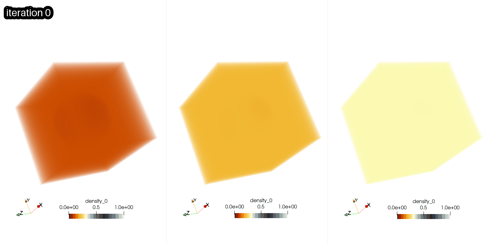
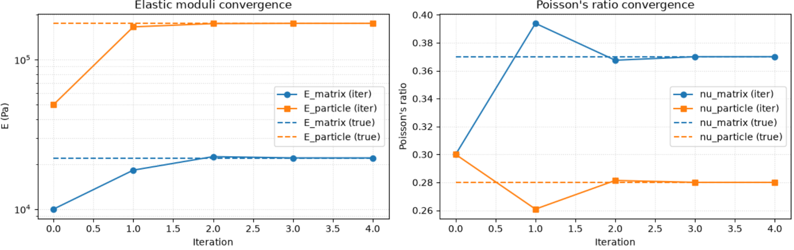

# Summary
Many applications in Scientific Computing require not only the fast solution of a forward problem $\theta\rightarrow u \rightarrow J$, which relates some input parameters $\theta$ to the solution $u=u(\theta)$ of a partial differential equations (PDE) and ultimately an objective function $J=J(u(\theta))$, but also the computation of sensitivites $\delta J/\delta \theta$. Recently, powerful frameworks such as JAX @Bradbury:2018 have become available to address this challenge while allowing the user to express the problem at a high abstraction level. We introduce an differentiable JAX-based library for solving a system of coupled PDEs that arise in continuum mechanics. This allows the efficient modelling of problems which are described by the stationary Cauchy equation together with a user-defined constituitive law that relates stress $\sigma$ and strain $\varepsilon$. The user interacts with the library by defining a custom function `compute_sigma(epsilon,param)` which depends on arbitrary parameters $\theta$ encoded in `params`. The code is inherently differentiable and uses the adjoint state method @Hinze:2008 to propagate gradients through the iterative Lippmann Schwinger solver introduced in @Moulinec:1998; Anderson acceleration @Wicht:2021 is also supported. Our method can be used to compute sensitivities with respect to the input parameters $\theta$, which is also required if the equations are solved in a Scientific Machine learning context such as in @Pestourie:2023. We demonstrate the application of the library to a topology optimisation problem for a porous metamaterial.

# Statement of need
Many materials of interest in engineering, such as carbon-fibre composites **REFERENCE**, can be modelled by solving a system of PDEs for spatially varying stress $\sigma(x)$ and strain $\varepsilon(x)$. In general, these two quantities are related by a constituitive law of the form $\sigma = \Sigma(\varepsilon|\theta)$ which depends on problem-specific parameters $\theta$. For example, for linear elasticity problems $\theta$ represents the spatially varying elasticity tensor $C(x)$ and $\sigma(x)=C(x)\varepsilon(x)$. The PDE solver might be embedded into an outer iteration, for example when including dynamic fracture formation @Chen:2019 where $\Sigma$ depends non-linearly on $\varepsilon$. The Lippmann Schwinger iteration with a FFT-based based homogenous solver @Moulinec:1998, @Schneider:2021 is a widely used and highly efficient method if the PDE system is discretised on a structured grid. 

However, in many cases, not just the value of some objective function $J=J(\varepsilon,\sigma)$ needs to be computed, but the sensitivity $\delta J/\delta \theta$ to the input parameters is also required. This includes applications in uncertainty quantification **REFERENCE** and hybrid machine learning approaches such as Physics Enhanced Surrogates (PEDS) @Pestourie:2023, which embed the PDE solver into a machine-learning workflow.

To resolve fine structure in multiscale simulations, implementations need to be fast, differentiable and easily adaptable to arbitrary constituitive laws specified by domain specialists. Our code addresses this challenge since it allows the differentiable solution of the fundamental PDEs for an arbitrary, user defined constitutitive law.

Usually the dimension of the objective function $J$ is much smaller than the dimension of the input parameters $\theta$ and *forward mode differentiation* with Jabobian-vector products (jax.jvp's) is very inefficient (see discussion in Section 2 of @Pundir:2025). On the other hand, using *reverse mode differentiation* (backpropagation) is not trivial due to the iterative nature of the Lippmann Schwinger solver:

* In the forward pass, the states for all iterations need to be stored to allow back-propgation of gradients, which leads to significant memory overhead and might make the simulation of large problems intractable.
* If - as in all real applications - a dynamic stopping criterion is used to terminate the iteration, JAX, cannot compute the reverse mode gradient since the trip-count of while-loops is unknown at (just-in-time-)compile time.

To address these issues, we employ the adjoint state method (see e.g. @Hinze:2008, @Johnson:2012). This leads to an adjoint Lippmann Schwinger equation of a very simular structure which is solved iteratively.

# State of the field
Since the semial work in @Moulinec:1998, a well established approach has been to solve the PDEs for stress and strain with the iterative Lippmann-Schwinger algorithm. This is used in sophisticated software packages for material modelling such as AMITEX @Gelebart:2020, which is implemented in Fortran. Recently there has been significant interest in differentiable implementations. This has be spurned by the advent of easy-to-use libraries such as JAX @Bradbury:2018 and PyTorch @Paszke:2019, which allow the automatic forward and backward propagation of gradients in sophisticated neural network architectures. JAX employs just-in-time (JIT) compilation to generate efficient code which runs on CPUs and GPUs. The authors of @Pundir:2025 describe a JAX implementation for material modelling: the user only needs to encode the functional relationships and all gradients are derived symbolically in JAX. In a related paper @Pundir:2026, automatic differentiation (AD) is used to automatically derive the PDEs from the energy function and then solve them with the finite element method. A similar approach is also employed in @Bluhdorn:2022: the authors describe a C++ implementation of AD which also leverages GPUs. In this work, we focus on the efficient implementation of differentiable Lippmann Schwinger iterations based on the adjoint-state method, which allows reserve mode differentiation. This method is widely used for PDE solvers based on finite elements, consider for example pyadjoint @Mitusch:2019, which has been integrated into the Firedrake framework @Farrell:2013, @Rathgeber:2016. The approach has recently been used for material modelling @Farsi:2025. The novelty of our work is the application to Lippmann Schwinger solvers, which are expected to give superior performance on structured grids.

# Software design

## JAX implementation

Since the code is based on JAX, all functions are pure and parameters are passed as state variables. The central functionality is exposed through the function `lippmann_schwinger()` whichs gets passed as a user-defined constituitive law $\Sigma(\varepsilon|\theta)$ of the form:

```Python
def compute_sigma(epsilon, params):
    # Compute stress sigma from strain epsilon, given params
    return sigma
```

Internally, this calls a backend function which is equipped with custom reverse mode gradients through JAX's `defvjp` functionality. It should be stressed that `compute_sigma()` can be any function, as long as it is reverse mode differentiable, and by design our library allows the implementation of non-trivial models such as the one in @Chen:2019.

For convenience, special cases for isotropic and anisotropic elastic materials have been implemented as well; in both cases the constituitive law is implemented in `hooke.py` and the user only needs to pass the relevant entries of the elasticity tensor.

## Example usage

Consider an isotropic elastic material for which $\sigma_{ij}(x) = \lambda(x) \operatorname{tr}(\varepsilon(x))\delta_{ij} + 2\mu(x)\varepsilon_{ij}(x)$. In this case $\theta = \{\mu(x),\lambda(x)\}$ and the constituitive law $\Sigma(\varepsilon|\theta)$ is implemented as the following function:

```Python
def compute_sigma(epsilon, params):
    tr_epsilon = epsilon[0, ...] + epsilon[1, ...] + epsilon[2, ...]
    sigma = 2 * params["mu"] * epsilon + params["lambda"] * jnp.stack(
        3 * [tr_epsilon] + 3 * [jnp.zeros(epsilon.shape[-3:], dtype=epsilon.dtype)]
    )
    return sigma
```

The parameters are passed as a dictionary which constitutes a JAX pytree:

```Python
params = {"lambda": lmbda, "mu": mu}
```

In the code, we first import the necessary libraries

```Python
import numpy as np
import jax

from jax import numpy as jnp

from jaxmaterials.common import GridSpec
from jaxmaterials.solver.lippmann_schwinger import lippmann_schwinger
```

and construct a structured grid of the domain $\Omega = [0,1]\times[0,1]\times[0,\frac{1}{2}]$ with $32\times32\times16$ voxels:

```Python 
nx, ny, nz = 32, 32, 16
grid_spec = GridSpec(nx, ny, nz, Lx=1.0, Ly=1.0, Lz=0.5)
```

In this example, the Lame parameters $\mu(x)$, $\lambda(x)$ are set to random values and only the first component of the mean strain $\overline{\varepsilon}$ is nonzero:

```Python
rng = np.random.default_rng(seed=47273)
mu = rng.uniform(low=0.8, high=1.1, size=(nx, ny, nz)).astype(np.float32)
lmbda = rng.uniform(low=0.6, high=0.7, size=(nx, ny, nz)).astype(np.float32)
epsilon_bar = np.array([1,0,0,0,0,0]),dtype=np.float32)
params = {"lambda": lmbda, "mu": mu}
```

As in @Moulinec:1998 the reference Lame parameters are obtained by averaging the largest and smallest values across the domain $\mu^0=[\mu]$, $\lambda^0=[\lambda]$ with $[f] := \frac{1}{2}\left(\min_{x\in\Omega}\{f(x)\} + \max_{x\in\Omega}\{f(x)\}\right)$:

```Python
ref_params = {
    key: 1 / 2 * (np.min(value) + np.max(value)) for (key, value) in params.items()
}
```

Assume that we are interested in the objective function $J = \varepsilon^2+\sigma^2$. This can be implemented as a function of $\theta$, $\overline{\varepsilon}$ by calling the differentiable Lippmann Schwinger solver:

```Python
def loss_fn(params, epsilon_bar):
    epsilon, sigma = lippmann_schwinger(
        compute_sigma, params, epsilon_bar, ref_params, grid_spec
    )
    return jnp.sum(epsilon**2 + sigma**2)
```

Finally, gradients of $J$ with respect to $\theta$, $\overline{\varepsilon}$ can be computed by using JAX's autodiff capabilities, for example

```Python
grad_fn = jax.grad(loss_fn, argnums=(0, 1))
g_params, g_epsilon_bar = grad_fn(params, epsilon_bar)
```

### Special case: isotropic elastic material

In this particular case we can also use the bespoke function `lippmann_schwinger_isotropic()` which assumes an isotropic elastic constituitive law. This function only needs to be passed the Lame parameters `params = {"lambda": lmbda, "mu": mu}` and automatically computes $\mu^0$, $\lambda^0$:

```Python
from jaxmaterials.solver.lippmann_schwinger import lippmann_schwinger_isotropic


def loss_fn(params, epsilon_bar):
    epsilon, sigma = lippmann_schwinger_isotropic(
        params, epsilon_bar, grid_spec=grid_spec
    )
    return jnp.sum(epsilon**2 + sigma**2)
```

If we are only interested in the forward solve, we can also use the slightly more efficient CUDA implementation

```Python
epsilon, sigma = lippmann_schwinger_isotropic(
    params, epsilon_bar, grid_spec, use_cuda=True
)
```

## Low-level CUDA-C implementation

In addition to the Python code, a low level CUDA-C implementation for elastic materials is also provided and it can be accessed through the same interface functions. Note that this needs to be compiled separately (with CMake). Depending on the hardware, this can be faster than the JAX code, in particular for the isotropic case. At the moment, the CUDA implementation is not differentiable, but in principle this limitation could be overcome by implementing the adjoint Lippmann Schwinger solve.

# Research impact statement


## Benchmarking against existing FFT solver
This section presents some selected examples demonstrating the application of JaxMaterials in various research topics. 

## Topology optimisation
Periodic porous metamaterials were designed using topology optimisation to maximise the effective bulk modulus $K$, subject to prescribed solid volume fractions $\phi=0.1$, $0.2$, $0.3$. 
A cubic Representative Volume Element (RVE) of dimensions $0.5\times 0.5 \times 0.5$ $mm^3$ was considered. The solid phase was assigned a Young's modulus of $E_1=1$ GPa and a Poisson's ratio of 0.3, while the void phase was approximated bys a much softer material with Young's modulus of $E_0=10^{-6}$ GPa. 
The combination of a very high stiffness contrast, high porosity, and complex pore morphology can occasionally slow the convergence of the Lippmann-Schwinger solver, often requiring >2000 iterations to reach `tol=1e-3` with Anderson acceleration (`depth=4`). Therefore, the iterative solution was terminated after 2000 iterations. However, as shown in the Results section, this did not compromise the stability of the optimisation process.

The optimisation was performed using optimality criteria method [REF], requiring the computation of the gradient of the objective function (negative effective bulk modulus, $c=-K$) with respect to the density map $\rho$. The effective bulk modulus $K$ was computed from one homogenisation simulation subject to a macroscopic strain load $\overline{\boldsymbol{\varepsilon}}= (1,1,1,0,0,0)^T$ (energy-based method [REF]):

$$
\begin{aligned}
K &= \frac{1}{9} \sum_{i,j=1}^{3} C_{iijj}
   = \frac{1}{9} \overline{\boldsymbol{\varepsilon}}^T : \mathbb{C} : \overline{\boldsymbol{\varepsilon}}
\qquad\text{with}\qquad
\overline{\boldsymbol{\varepsilon}} = (1,1,1,0,0,0)^T
\end{aligned}
$$

This computation was programmed as a differentiable function making use of the `lippmann_schwinger()` function:
```Python 
def compute_c(rho, mat, grid_spec):
    # Compute reference material parameters Lambda0, Mu0
    E = mat['E0'] + (mat['E1'] - mat['E0']) * (rho + mat['kk']) ** mat['penalty']

    lmbda = E * mat['nu'] / (1. + mat['nu']) / (1. - 2. * mat['nu'])
    mu = E / (2.0 * (1. + mat['nu']))

    lmbda0 = jax.lax.stop_gradient(0.5 * (jnp.max(lmbda) + jnp.min(lmbda)))
    mu0 = jax.lax.stop_gradient(0.5 * (jnp.max(mu) + jnp.min(mu)))

    # Solve linear elastic problem via Lippmann-Schwinger FFT solver.
    epsilon_bar = jnp.array([1.,1.,1.,0.,0.,0.])

    epsilon, sigma = lippmann_schwinger(
        compute_sigma_from_density,
        (rho, mat),
        epsilon_bar,
        ref_params={"lambda": lmbda0, "mu": mu0},
        grid_spec=grid_spec,
        tol=1.0e-3,
        maxits=2000,
        verbose=1,
        depth=4,
    )

    sigma_bar = jnp.mean(sigma, axis=[1, 2, 3])
    energy = jnp.sum( epsilon_bar[:3]*sigma_bar[:3] +
                      epsilon_bar[3:]*sigma_bar[3:] * 2 )

    return -energy / 9
```

The local constitutive model `compute_sigma_from_density()` takes the density field $\rho$ as input:
```Python
def compute_sigma_from_density(epsilon, params):
     rho, mat = params

    E = mat['E0'] + (mat['E1'] - mat['E0']) * (rho + mat['kk']) ** mat['penalty']

    lmbda = E * mat['nu'] / (1. + mat['nu']) / (1. - 2. * mat['nu'])
    mu = E / (2.0 * (1. + mat['nu']))

    tr_epsilon = epsilon[0] + epsilon[1] + epsilon[2]
    sigma = jnp.zeros_like(epsilon)
    sigma = sigma.at[:3].set((lmbda * tr_epsilon)[None, ...] + 2.0 * mu * epsilon[:3])
    sigma = sigma.at[3:].set(2.0 * mu * epsilon[3:])
    return sigma
```

Then the sensitivity $\frac{\partial c}{\partial \rho}$ can be readily evaluated by
```Python
value_grad_fn = jax.value_and_grad(compute_c, argnums=0, has_aux=False)
c, dc = value_grad_fn(rho, mat, grid_spec)
```

To mitigate numerical instabilities (checker-boarding and mesh-dependency), a sensitivity filtering [REF] was applied to the sensitivity:
$$
\widetilde{\frac{\partial c}{\partial \rho}} = \frac{(\frac{\partial c}{\partial \rho}\rho) \odot \omega}{\overline{\omega} \rho}
$$
where $\odot$ denotes periodic convolution (the RVE is periodic). $\omega$ is the convolution kernel that was set to a $2\times 2\times 2$ array with all elements equal to 1, and $\overline{\omega}$ is the sum of all elements in the kernel.

The density map $\rho$ was initialised with the target solid volume fraction $\phi$ in a spherical structure as

$$
\rho =
\begin{cases}
    \phi / 2, & x \in \mathcal{D}, \\
    \phi, & \text{otherwise}.
\end{cases}
\qquad\text{with}\qquad
\mathcal{D}\text{ is the sphere region}
$$
In all cases, the sphere diameter was set to 2/3 of the domain size. 

The evolution of the optimised topology for the three prescribed volume fractions is shown in Figure 1. For visualisation purposes, only a half-cut view of each structure is displayed, revealing the internal morphology of the evolving porous architectures.


<figure style="margin: 0; text-align: center;">
  
  <figcaption style="text-align: center;">
Figure 1: Evolution of the optimised structure with constraint on different volume fractions of the solid phase: left - $\phi=10%$, middle - $\phi=20%$, right - $\phi=30%$.
</figcaption>
</figure>


The convergence histories of the effective bulk modulus are presented in Figure 2 for the three volume-fraction constraints. In all cases, the optimisation process yields a monotonic increase in bulk stiffness before reaching a stable plateau, indicating successful convergence.

<figure>
<div style="display: flex; justify-content: center; gap: 10px;">
<figure style="margin: 0; text-align: center;">
  
</figure>
</div>
<figcaption style="text-align: center;">
Figure 2: Evolution of the effective bulk modulus of the metamaterial at various solid volume fractions (vf).
</figcaption>
</figure>

The computation time was not recorded, but all three cases were completed within approximately one hour using a Nvidia RTX A6000 GPU.

## Phase-field fracture problem
This example applies JaxMaterials to the implementation of a variational phase-field fracture model [Miehe et al. 2010]. Two coupled equation systems need to be solved, representing the elasticity problem:
$$
\begin{aligned}
\nabla \cdot \boldsymbol{\sigma} &= 0 \\
\boldsymbol{\sigma} &= (1-d)^2 \left[\lambda \langle \operatorname{tr}(\boldsymbol{\varepsilon}) \rangle_+ \mathbf{I}
+ 2\mu \boldsymbol{\varepsilon}_+\right] \\
&\quad + \left[\lambda \langle \operatorname{tr}(\boldsymbol{\varepsilon}) \rangle_- \mathbf{I}
+ 2\mu \boldsymbol{\varepsilon}_-\right]
\end{aligned}
$$

and the phase field problem:
$$
\frac{g_c}{l_c} \left[ d - l_c^2 \Delta d \right] = 2(1-d) \mathcal{H}(\boldsymbol{\varepsilon})
$$

where $\boldsymbol{\varepsilon}_{+}$ and $\boldsymbol{\varepsilon}_{-}$ denote the positive and negative components of the strain tensor, respectively, obtained through spectral decomposition. where $\mathcal{H}$ denotes the history field associated with the maximum positive elastic energy density, defined as $\mathcal{H}(\mathbf{x}, t)
:= \max_{\tau \in [0,t]} \psi^{+}\!\left(\boldsymbol{\varepsilon}(\mathbf{x}, \tau)\right).
$.

Following [Chen et al. 2019], we use the FFT method for solving these two subproblems under a stagerred scheme.

**Table 1. Staggered FFT scheme for solving the phase-field fracture problem**
| Step | Procedure |
|------|-----------|
| **Initialization** | Given the initial strain field $\varepsilon^{0}(\mathbf{x})$, history field $\mathcal{H}^{0}(\mathbf{x})$, and phase field $d^{0}(\mathbf{x})$. |
| **Loop** | **While** $t_{n+1} \leq T$, given $\varepsilon^{t_n}(\mathbf{x})$, $d^{t_n}(\mathbf{x})$, and $\mathcal{H}^{t_n}(\mathbf{x})$. |
| **1** | Solve the phase-field problem to obtain the updated phase field: 
|       | $(l_c, g_c, \mathcal{H}^{t_n}) \rightarrow \text{PhaseFieldSolve} \rightarrow d^{t_{n+1}}(\mathbf{x})$|
| **2** | Solve the mechanical problem to obtain the strain field: 
|       | $(\lambda, \mu, d^{t_{n+1}}, \overline{\varepsilon}) \rightarrow \text{JaxMaterials} \rightarrow \varepsilon^{t_{n+1}}(\mathbf{x})$|
| **3** | Update the history field to obtain: 
|       | $\varepsilon^{t_{n+1}}(\mathbf{x}) \rightarrow \mathcal{H}^{t_{n+1}}(\mathbf{x})$|
| **4** | Advance the time step: $t_n \leftarrow t_{n+1}$. |
| **Output** | Phase field $d(\mathbf{x},t)$, strain field $\varepsilon(\mathbf{x},t)$, and history field $\mathcal{H}(\mathbf{x},t)$. |

The algorithm of [Chen et al. 2019] was used to solve the phase-field problem (step 1 in the loop of Table 1), see [diffmat repo] for the numerical implementation including the adjoint method to enable automatic differentiation.
The elasticity problem (step 2 in the loop of Table 1) can be readily solved using JaxMaterials with the local constitutive function:

```Python
def compute_sigma_damaged(epsilon, params):
    lmbda, mu, d, k = params

    eps_tensor = voigt_to_tensor(epsilon)

    tr_eps = jnp.trace(eps_tensor, axis1=-2, axis2=-1)
    tr_eps_plus = jnp.maximum(tr_eps, 0.0)
    tr_eps_minus = jnp.minimum(tr_eps, 0.0)

    # Get eigenvalues n eigenvectors
    eigvals, eigvecs = jnp.linalg.eigh(eps_tensor)
    eigvals_plus = jnp.maximum(eigvals, 0.0)
    eigvals_minus = jnp.minimum(eigvals, 0.0)

    # Reconstruct the positive and negative strain tensors (eps_plus / eps_minus)
    # This uses einsum to do: V * Lambda_plus * V^T across the entire 3D grid instantly
    eps_plus_tensor = jnp.einsum(
        "...ia,...a,...ja->...ij", eigvecs, eigvals_plus, eigvecs
    )
    eps_minus_tensor = jnp.einsum(
        "...ia,...a,...ja->...ij", eigvecs, eigvals_minus, eigvecs
    )

    # Convert back to Voigt notation for the stress equation
    eps_plus_v = tensor_to_voigt(eps_plus_tensor)
    eps_minus_v = tensor_to_voigt(eps_minus_tensor)

    # Calculate pure tension stress and pure compression stress
    sigma_plus = 2.0 * mu * eps_plus_v
    sigma_minus = 2.0 * mu * eps_minus_v
    vol = vol = lmbda * tr_eps_plus
    sigma_plus = sigma_plus.at[0].add(vol)
    sigma_plus = sigma_plus.at[1].add(vol)
    sigma_plus = sigma_plus.at[2].add(vol)

    vol = lmbda * tr_eps_minus
    sigma_minus = 2.0 * mu * eps_minus_v
    sigma_minus = sigma_minus.at[0].add(vol)
    sigma_minus = sigma_minus.at[1].add(vol)
    sigma_minus = sigma_minus.at[2].add(vol)

    # Apply damage degradation (g_d) ONLY to the tension (positive) stress
    return ((1.0 - d[None, ...]) ** 2 + k) * sigma_plus + sigma_minus
```

The simulation result of a particle reinforced composite is shown in Figure 3. The total simulation time was 2.6 hours using a workstation with a Nvidia  RTX A6000 GPU. We note that this can potentially be further improved by implementing an acceleration algorithm (such as Anderson's) for the phase-field problem.

<figure>
<div style="display: flex; justify-content: center; gap: 10px;">
<figure style="margin: 0; text-align: center;">
  
</figure>
</div>
<figcaption style="text-align: center;">
Figure 3: Phase-field fracture simulation result of a particle reinforced composite.
</figcaption>
</figure>


## Inverse problem: material parameter identification
In this example, we use JaxMaterial to implement a material parameter identification workflow, as shonw in Figure 4. 


<figure>
<div style="display: flex; justify-content: center; gap: 10px;">
<figure style="margin: 0; text-align: center;">
  
</figure>
</div>
<figcaption style="text-align: center;">
Figure 4: Overall workflow of the material identification workflow using JaxMaterials.
</figcaption>
</figure>

Consider an particle reinforced composite material. The elastic properties of the particles and matrix ($u=(E^{particle},E^{matrix},\nu^{particle},\nu^{matrix})$) are unknown. After some mechanical tests (here generated by numerical simulations), we obtain the stress responses of the composite for given strain loading conditions (pair of $(\overline{\varepsilon}^{exp}, \overline{\sigma}^{exp},)$). The inverse problem seeks the constituent properties using the macroscopic measurements. This can be solved using the Newton-Raphson method, trying to minimise the residual vector $r(u)=\overline{\sigma}^{sim}(u)-\overline{\sigma}^{exp}$. 
The Jacobian $J=\frac{\delta r}{\delta u}$ is needed in the Newton-Raphson method, and the differentiablity by Jaxmaterials can provide this readily using the following code:

```Python
# forward simulation: u -> sigma_bar
forward_fn = lambda p: forward_sigma_vector(p, grid, matID, eps_probes)
# residual function: sigma_bar - sigma_target
residual_fn = lambda p: forward_fn(p) - sigma_target
# jacobian function by jax
jac = jax.jacobian(residual_fn)
...
# jacobian matrix evaluated at a given u
J = jac(u)
```

The convergence history of this material identification procedure is shown in FIgure 5. All constituent properties were successfully identified with only 4 iterations.
We noticed that the adjoint solver failed to converge after 2000 iterations (set to exit the Lippmann-Scwinger loop) during the computation of the Jacobian. However, this did not affect the convergence as shown in Figure 5.

<figure>
<div style="display: flex; justify-content: center; gap: 10px;">
<figure style="margin: 0; text-align: center;">
  
</figure>
</div>
<figcaption style="text-align: center;">
Figure 5: Convergence history of the Newton-Raphson material identification procedure for a particle-reinforced composite.
</figcaption>
</figure>


# Mathematics

## PDE Problem
We consider the following system of equations for spatially varying strain $\varepsilon$ and stress $\sigma$:

$$
\begin{aligned}
    \partial_j \sigma_{ij} &= 0 & \text{(Cauchy momentum equation)}\\
    \sigma_{ij} &= \Sigma_{ij}(\varepsilon|\theta)\qquad\text{with $\varepsilon_{k\ell} = \varepsilon^*_{k\ell} + \overline{\varepsilon}_{k\ell}$} & \text{(Constituitive law)}\\
    \varepsilon^*_{k\ell} &= \frac{1}{2}\left(\partial_k u_\ell + \partial_\ell u_k\right) & \text{(Strain-displacement relation)}
\end{aligned}\label{eqn:continuum}
$$

The problem is solved in a rectangular domain with periodic boundary conditions for the displacement field $u(x)$ and for given average strain $\overline{\varepsilon}$.

The problem-dependent constituitive law $\sigma = \Sigma(\varepsilon|\theta)$ depends on the parameters $\theta$. Special cases are:

* Linear anisotropic materials with $\sigma = C \varepsilon$ where $C=C(x)=:\theta$ is the spatially varying elasticity tensor
* Linear isotropic materials for which $C(x) = \lambda(x) \delta_{ij}\delta_{k\ell} + \mu(x) (\delta_{ik}\delta_{j\ell} + \delta_{i\ell}\delta_{jk})$. In this case $\theta$ encapsulates the two Lame parameters $\{\mu(x),\lambda(x)\}=:\theta$.

## Lippmann Schwinger iteration

The problem in (\autoref{eqn:continuum}) can be written in the form 

$$
\varepsilon + \Gamma^0 * (\Sigma(\varepsilon|\theta) - C^0 \varepsilon)= \overline{\varepsilon}\label{eqn:lippmann_schwinger}
$$

Here, $C^0$ is the homogenous isotropic elasticity tensor described by the two reference Lame parameters $\mu^0,\lambda^0\in\mathbb{R}$. The operator $\Gamma^0$ is constructed from the tensor-valued Green's function of the corresponding PDE (see appendix of @Moulinec:1998). 

As discussed in @Moulinec:1998, the self-consistent equation in (\autoref{eqn:lippmann_schwinger}) is solved by exploiting the fact that $\Gamma^0$ is diagonal in Fourier space and by applying the Lippmann Schwinger iteration

$$
\varepsilon^{(s+1)} = \overline{\varepsilon} - \mathcal{F}^{-1} \circ\widehat{\Gamma}^0 \circ\mathcal{F}\tau^{(s)} \qquad\text{with $\tau^{(s)} = (\Sigma(\varepsilon^{(s)}|\theta) - C^0\varepsilon^{(s)})$ and $\varepsilon^{(0)} = \overline{\varepsilon}$}
$$

Here $\mathcal{F}$ and $\mathcal{F}^{-1}$ denote the forward and inverse Fourier transform respectively. In the code we also implemented Anderson acceleration @Wicht:2021 which - for linear stress-strain relationships - is equivalent to a preconditioned GMRES iteration @Walker:2011.

## Reverse-mode differentiation with the adjoint method

Let $J=J(\varepsilon,\sigma)$ be the objective function. We want to compute the sensitivities

$$
\frac{\delta J}{\delta \theta},\quad \frac{\delta J}{\delta \overline{\varepsilon}}
$$

subject to the condition that strain $\varepsilon=\varepsilon(\theta,\overline{\varepsilon})$ and stress $\sigma=\sigma(\theta,\overline{\varepsilon})$ satisfy the equations in (\autoref{eqn:continuum}) for given $\overline{\varepsilon}$ and material parameters $\theta$.

Since every step of the Lippmann Schwinger iteration consists of elementary, differential operations, in principle the sensitivites can be obtained with JAX automatic differentiation capabilities provided the constitutitive law $\sigma=\Sigma(\varepsilon|\theta)$ if differentiable. As reverse mode-differentiation is not available for while-loops, we employ the adjoint state method @Hinze:2008, @Johnson:2012. This leads to an adjoint Lippmann Schwinger equation of a very simular structure as (\autoref{eqn:lippmann_schwinger}) which is solved iteratively, possibly with Anderson acceleration.

$$
\Lambda + (\Gamma^0*\Lambda)\frac{\delta \Sigma}{\delta \varepsilon} - \lambda^0 \operatorname{tr}(\Gamma^0*\Lambda)\mathbb{I} - 2\mu^0 (\Gamma^0*\Lambda) = -\left(\frac{\delta J}{\delta \varepsilon}+\frac{\delta J}{\delta \sigma}\frac{\delta \Sigma}{\delta \varepsilon}\right)
$$

From $\Lambda$ the derivatives of the objective function with respect to the parameters $\theta$ and the average strain $\overline{\varepsilon}$ can be computed as

$$
\frac{\delta J}{\delta\theta} = \left(\frac{\delta J}{\delta\sigma} + \Gamma^0*\Lambda\right): \frac{\delta\Sigma}{\delta \theta},\qquad
\frac{\delta J}{\delta\overline{\varepsilon}} = -\int_\Omega \Lambda(z)\;dz.
$$

# AI usage disclosure

 Generative AI (mainly GitHub copilot) was used to generate some of the code, to identify and locate bugs and to generate informed feedback on the code and documentation. Code generation was closely supervised by limiting it to routine transformations and by breaking it into small, transparent tasks the correctness implementation of which could be easily verified. All generated code and all AI suggestions were carefully reviewed by the authors to ensure correctness. 

# Acknowledgements

# References